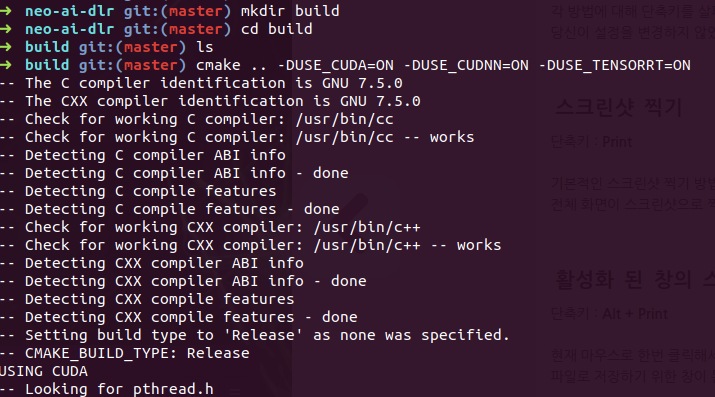
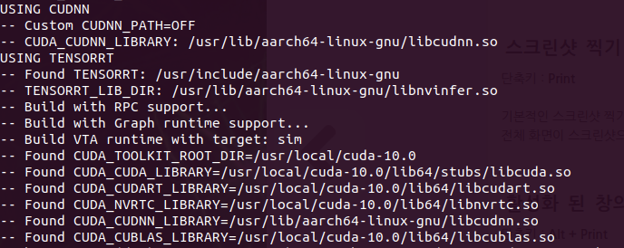
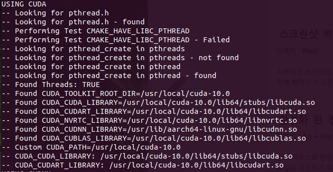
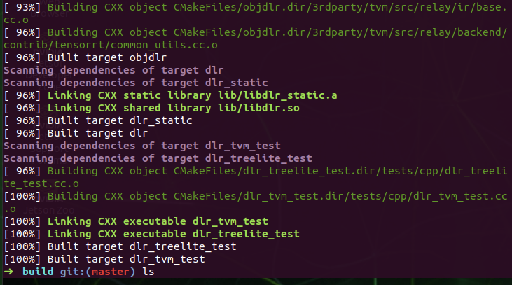
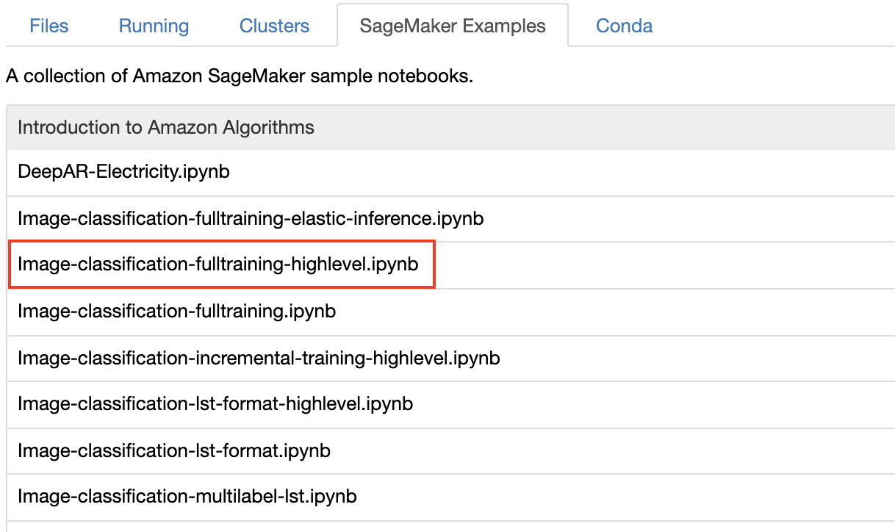
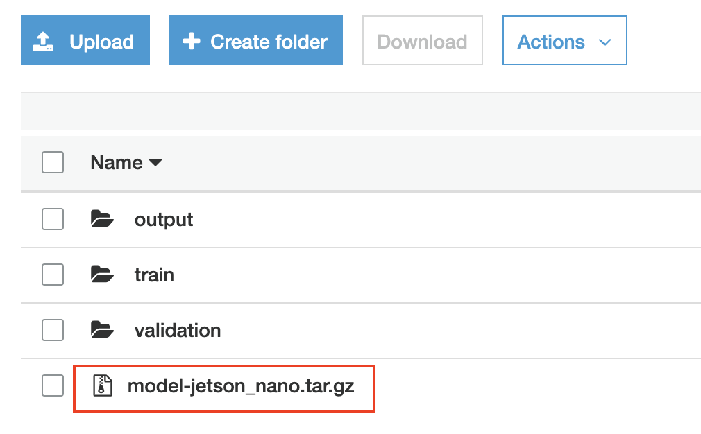

# Neo-DLR on NVIDIA Jetson Nano

## Objective

1. Neo-DLR 패키지 인스톨 및 테스트
2. SageMaker Neo에서 학습한 모델을 neo-dlr로 로드하기

## Prerequisites



## 1. Neo-DLR 패키지 인스톨 및 테스트

Reference: [https://neo-ai-dlr.readthedocs.io/en/latest/install.htm](https://neo-ai-dlr.readthedocs.io/en/latest/install.html)

pre-compiled 패키지에는 TensorRT 5.0 dependency가 걸려 있는데, 이렇게 하게 되면 DLRModel\(\) 호출 시 OpenMP, TensorRT 관련 에러가 발생함. \(아래 스크린샷 참조\)

관련 이슈가 포럼에 올라왔지만, 담당자도 모른다고 함\(만들어 놓고 쓰지 않는....\); [https://forums.developer.nvidia.com/t/dlr-runtime-on-nano/74579](https://forums.developer.nvidia.com/t/dlr-runtime-on-nano/74579)


따라서, pip install이 아닌 소스 파일을 직접 컴파일하여 빌드해야 함.

### 1\) 소스 파일 다운로드

```bash
git clone --recursive https://github.com/neo-ai/neo-ai-dlrcd neo-ai-dlr
cd neo-ai-dir
mkdir build
cd build
```

### 2\) Building for GPU

```bash
cmake .. -DUSE_CUDA=ON -DUSE_CUDNN=ON -DUSE_TENSORRT=ON
make -j3
```

gcc 컴파일러, CUDA, CUDNN, TensorRT가 모두 설치되어야 정상적으로 인스톨됨. \(아래 스크린샷 참조\)

*   
*   

### 3\) 파이썬 패키지 인스톨

```bash
cd ../python
python3 setup.py install --user
```

### 4\) 테스트

두 개의 테스트 파일\(load\_and\_run\_tvm\_model.py, load\_and\_run\_treelite\_model.py\)들이 제공됨

* `load_and_run_tvm_model.py`: Image Classification 테스트
* `load_and_run_treelite_model.py`: XGBoost classification 테스트

load\_and\_run\_tvm\_model.py는 정상 동작하나, load\_and\_run\_treelite\_model.py는 s3 모델 아티팩트 다운로드 권한 문제로 에러 발생

```bash
cd tests/python/integration/
python3 load_and_run_tvm_model.py
```


```bash
python3 load_and_run_treelite_model.py
```


## 2. SageMaker Neo에서 학습한 모델을 neo-dlr로 로드하기

Reference: [https://aws.amazon.com/ko/blogs/korea/amazon-sagemaker-neo-train-your-machine-learning-models-once-run-them-anywhere/](https://aws.amazon.com/ko/blogs/korea/amazon-sagemaker-neo-train-your-machine-learning-models-once-run-them-anywhere/)

### 1\) Image-Classification

SageMaker Examples의 `Image-classification-fulltraining-highlevel.ipynb` 사용



Compile 바로 전까지의 코드 셀까지 실행

```python
ic.fit(inputs=data_channels, logs=True)
```

컴파일은 아래 두 가지 옵션 중에서 택일하여 수행

* Option 1: SageMaker 코드에서 컴파일; `target_instance_family=‘ml_m4’`에서 `target_instance_family=‘jetson_nano’`로 변경할 것! \(framework\_version=‘1.2.1’로 놓아도 무방하고 framework\_version=‘1.5.1’로 변경해도 잘 돌아감\)

```python
optimized_ic = ic.compile_model(target_instance_family='jetson_nano', 
                            input_shape={'data':[1, 3, 224, 224]},  # Batch size 1, 3 channels, 224x224 Images.
                            output_path=output_path,
                            framework='mxnet', framework_version='1.2.1')
```

* Option 2: SageMaker UI에서 직접 컴파일


s3에 저장된 모델 아티팩트\(예: model-jetson\_nano.tar.gz\)를 jetson\_nano로 복사



별도의 폴더에 압축 해제 후 \(예: model1\), 아래 코드로 테스트

**테스트 1:** dog.npy **다운로드 후 실행**

[dog.npy](Neo-DLR%20on%20NVIDIA%20Jetson%20Nano%205eee3961a11346f7bc14c11d4ccc3bed/dog.npy)

```python
import os
import numpy as np 
from dlr import DLRModel

model = DLRModel('model1', 'gpu')
image = np.load('dog.npy').astype(np.float32) # size is [1x3x224x224]
probs = model.run(image)
pred_class = probs[0].argmax()
print(pred_class)
```

**테스트2: 인터넷에 임의로 강아지 사진\(jpeg, png등\) 다운로드받아 저장 후 실행**

* pillow 패키지 설치 필요 \(pip3 install pillow\)

```python
import os
import numpy as np 
from dlr import DLRModel
from PIL import Image

NORMALIZE = True
size = 224

img = Image.open('./images/dog.jpg')
img = img.resize((size,size), Image.ANTIALIAS) # resize to 224x224
imarray = np.array(img).astype(np.float32)

if NORMALIZE: # z-normalization
    mu, std = imarray.mean(), imarray.std()
    imarray = (imarray - mu) / std

imarray = imarray.transpose(2,0,1) # channel is first
imarray = np.expand_dims(imarray, axis=0)
print(imarray.shape)

device = 'gpu'
model = DLRModel('model1', device)
#input_shape = {'data': [1, 3, 224, 224]}
probs = model.run(imarray)
pred_class = probs[0].argmax()
print(pred_class)
```


\[Note1\] 정답 레이블은 **55**가 되어야 하지만, epoch 횟수가 적고 0-255 스케일의 데이터가 아닌 z-normalized된 데이터를 Input으로 넣어서 결과가 제대로 안 나옴. 이는 epoch 횟수를 30회 정도로 조정하고 optimizer를 adam으로 지정 후, 0-255 스케일의 데이터를 그대로 넣으면 정확도가 많이 향상됨. \(단, Neo 컴파일 전/후 결과는 약간 다름\)

```text
Result: label - dog, probability - 0.6870654 # Neo 컴파일 전
Result: label - dog, probability - 0.6797071 # Neo 컴파일 후
```

\[Note2\] 상기 예제는 ResNet-18로 학습/컴파일한 모델이며, ResNet-50로 학습/컴파일 후 jetson nano에서 inference 수행 시에는 메모리 부족 오류 발생

### 2\) XGBoost

To be updated

