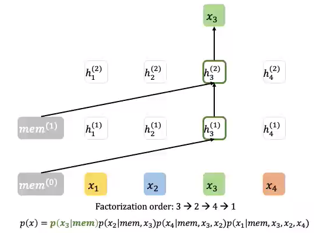
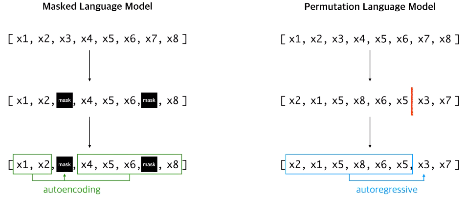
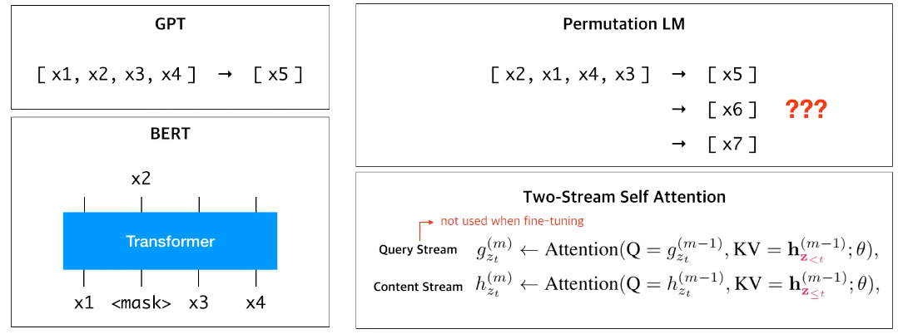

# XLNet: Generalized Autoregressive Pretraining for Language Understanding

### BERT의 한계

* Independent Assumption: 모든 마스크 토큰은 상호 독립이라 가정
* $$\mathcal{J}_{\text{BERT}} = \log p(\text{New } | \text{ is a city}) + \log p(\text{York } | \text{ is a city}) \\\mathcal{J}_\text{XLNet} = \log p(\text{New}\;|\;\text{is a city}) + \log p(\text{York}\;|\;\text{New}, \text{is a city})$$ 
* 마스크\(\) 토큰은 실제 다운스트림 task에 미등장
* 예전 context 정보를 잘 가져오지 못함; long-term dependency

### Autoregressive

이전 token들을 보고 다음 token 예측 \(예: ELMO, GPT 등\)

한쪽 방향의 정보만을 이용할 수 있기에, 문장에 대해 깊이 이해하기 어려움. 예외적으로 ELMO의 경우 양방향을 이용하지만, 각각의 방향에 대해 독립적으로 학습된 모델을 이용

$$\text{input sequence}: x = (x_1, x_2, ..., x_T) \\ \text{forward likelihood}:p(x) = \Pi^T_{t=1} p(x_t \mid x_{<t}) \\ \text{objective(forward)}: \max_{\theta} \space \log p_{\theta}(x) =\max_{\theta} \space \Sigma^T_{t=1} \log p(x_t \mid x_{<t})$$

### AutoEncoding\(AE\)

* Independent assumption: 주어진 input sequence에 대해 각 `[MASK]` token 의 정답 token이 등장할 확률은 독립이 아니지만, 독립으로 가정. → 독립이므로 각 확률의 곱으로 나타낼 수 있음. \(objective의 우변\)
* xt가 `[MASK]` token일 경우, mt=1, 나머지 경우에는 mt=0 ⇒ `[MASK]` token에 대해서만 prediction 진행. mt를 둬서 `[MASK]` token만 예측하는 objective

$$\text{input sequence}: \overline{x} = (x_1, x_2, ..., x_T) \\ \text{corrupted input}: \widehat{x} = (x_1, [\text{MASK}], ... x_T) \\ \text{likelihood}: p(\overline{x} \mid \widehat{x}) \approx \Pi_{t=1}^T p(x_t \mid \widehat{x}) \\ \text{objective}: \max_{\theta} \space \log p(\overline{x} \mid \widehat{x}) = \max_{\theta} \space \Sigma^T_{t=1} m_t \log p(x_t \mid \widehat{x})$$

AR과 달리 AE는 특정 \[MASK\] token을 맞추기 위해 양 방향의 정보를\(Bi-Directional Self-Attention\) 이용할 수 있음. 하지만 independant assumption으로 모든 \[MASK\] token이 독립적으로 예측됨으로써 이들 사이의 dependency 학습 불가능. 또한 noise\(\[MASK\] token\) 자체는 실제 fine-tuning 과정에는 등장하지 않으므로, pre-training 과 fine-tuning 사이의 불일치 발생

## Permutation Language Modeling

mem: 이전 context에서 가져온 정보

$$\text{input sequence}: x = (x_1, x_2, ..., x_T) \\ \text{likelihood} : \mathbb{E}_{z\backsim Z_T}[\Pi_{t=1}^Tp(x_{z_t} \mid x_{z<t})] \\ \text{objective}: \max_{\theta} \space \mathbb{E}_{z\backsim Z_T}[\Sigma_{t=1}^T \log \space p_{\theta}(x_{z_t} \mid x_{z<t})]$$

## Two-Stream Self-Attention

* target index의 위치가 불명확; 다음에 나올 단어가 어디에 위치하는지 모름
* Content Stream: 예측하고자 하는 토큰의 정보를 같이 사용
* Query Stream: 해당 토큰의 이전 정보까지만 가져오고 해당 위치에 있는 위치 임베딩과 random init 벡터만 가져옴

## Transformer-XL

#### Segment Recurrence

이전 segment의 state를 cache로 가지고 있음

#### Relative positional embedding

상대적으로 얼마나 멀리 있는지 계산

#### Pretraining

* BERT: BookCorpus + English Wikipedi
* XLNet: BookCorpus + English Wikipedia + Giga5 + ClueWeb + Common Crawl
* 512TPu v3 chips 500k steps \(batch size 2048, 2.5days\)

## References

* Paper
  * [https://arxiv.org/pdf/1906.08237.pdf](https://arxiv.org/pdf/1906.08237.pdf)
* Blog
  * [https://blog.pingpong.us/xlnet-review/](https://blog.pingpong.us/xlnet-review/)

