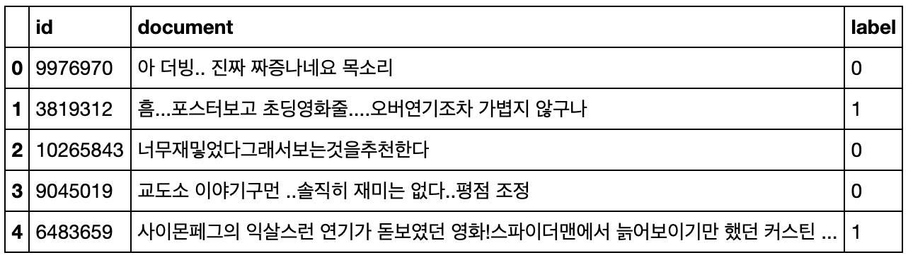
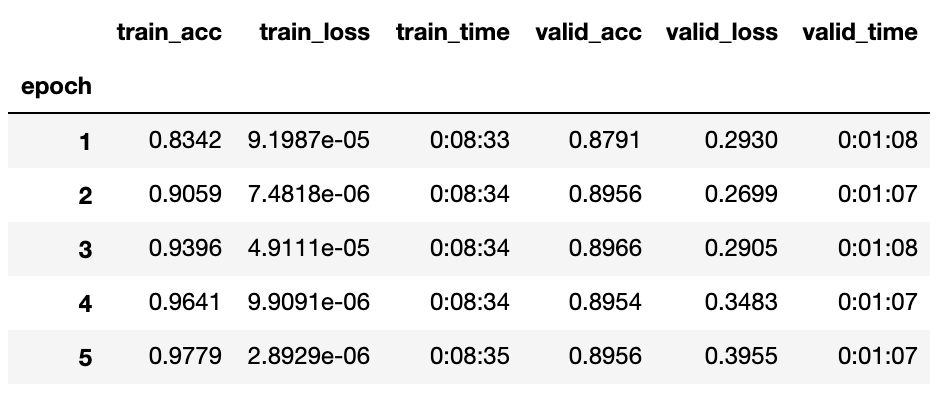
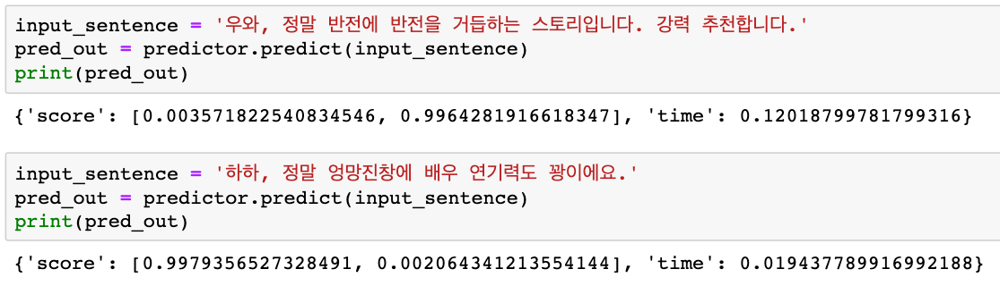

# \[Hands-on\] Fine Tuning Naver Movie Review Sentiment Classification with KoBERT using GluonNLP

## Goal

This document is for people who need fine-tuning KoBERT model. Currently, the original author’s PyTorch code for fine-tuning works fine if you follow the Colab tutorial on the official website as it is, but MXNet code does not work properly with the latest GluonNLP\(0.9.1\) version. So we modified it so that we can perform fine-tuning by referring to the GluonNLP tutorial \(See [https://gluon-nlp.mxnet.io/examples/sentence\_embedding/bert.html](https://gluon-nlp.mxnet.io/examples/sentence_embedding/bert.html)\).

## Notes

* Since Korean has a lot of vocabulary, it takes 2-3 times more time than English for fine tuning. Therefore, it is not recommended as a real-time hands-on lab. It is possible by sampling the dataset and training only 1 epoch. However, GPU-family\(p, g\) instances are recommended.
* The following website is strongly recommended as a tutorial for BERT fine-tuning. Fine-tuning takes less than 10 minutes.
  * [https://mccormickml.com/2019/07/22/BERT-fine-tuning/](https://mccormickml.com/2019/07/22/BERT-fine-tuning/)
* Naver Movie Review data is publicly available at [https://github.com/e9t/nsmc/,](https://github.com/e9t/nsmc/) and consists of 150,000 training data and 50,000 test data. This data is often used for NLP benchmarking like IMDB review data in Korea. Sample data is shown below.



## Prerequisites

* SageMaker GPU notebook instances or EC2 DLAMI
* Since CUDA 10.0 is the default, **you must upgrade to CUDA 10.1 or 10.2**. To respond to the latest version of gluonnlp, MXNet 1.6.0 installation is required, . Alternatively, you can use CUDA 10.1 DLAMI in the marketplace. **but MXNet 1.6.0 does not support CUDA 10.0**

  * CUDA Toolkit Download: [https://developer.nvidia.com/cuda-downloads](https://developer.nvidia.com/cuda-downloads)
  * Installation

  ```bash
  $ wget http://developer.download.nvidia.com/compute/cuda/10.2/Prod/local_installers/cuda_10.2.89_440.33.01_linux.run 
  $ sudo sh cuda_10.2.89_440.33.01_linux.run
  ```

## Step 1. Setting

Download the latest version of KoBERT. As of 2020/5/12, the latest version is 0.1.1.

```bash
$ git clone https://github.com/SKTBrain/KoBERT.git
```

Modify **kobert/mxnet\_kobert.py** as follows:

```bash
$ vim KoBERT/kobert/mxnet_kobert.py
```

```python
# coding=utf-8
# Copyright 2019 SK T-Brain Authors.
#
# Licensed under the Apache License, Version 2.0 (the "License");
# you may not use this file except in compliance with the License.
# You may obtain a copy of the License at
#
#     http://www.apache.org/licenses/LICENSE-2.0
#
# Unless required by applicable law or agreed to in writing, software
# distributed under the License is distributed on an "AS IS" BASIS,
# WITHOUT WARRANTIES OR CONDITIONS OF ANY KIND, either express or implied.
# See the License for the specific language governing permissions and
# limitations under the License.

import os
import sys
import requests
import hashlib

import mxnet as mx
import gluonnlp as nlp
from gluonnlp.model import BERTModel, BERTEncoder

from .utils import download as _download
from .utils import tokenizer

mxnet_kobert = {
    'url':
    'https://kobert.blob.core.windows.net/models/kobert/mxnet/mxnet_kobert_45b6957552.params',
    'fname': 'mxnet_kobert_45b6957552.params',
    'chksum': '45b6957552'
}

def get_mxnet_kobert_model(use_pooler=True,
                           use_decoder=True,
                           use_classifier=True,
                           ctx=mx.cpu(0),
                           cachedir='~/kobert/'):
    # download model
    model_info = mxnet_kobert
    model_path = _download(model_info['url'],
                           model_info['fname'],
                           model_info['chksum'],
                           cachedir=cachedir)
    # download vocab
    vocab_info = tokenizer
    vocab_path = _download(vocab_info['url'],
                           vocab_info['fname'],
                           vocab_info['chksum'],
                           cachedir=cachedir)
    return get_kobert_model(model_path, vocab_path, use_pooler, use_decoder,
                            use_classifier, ctx)

def initialize_model(vocab_file, use_pooler, use_decoder, use_classifier, ctx=mx.cpu(0)):

    vocab_b_obj = nlp.vocab.BERTVocab.from_sentencepiece(vocab_file,
                                                         padding_token='[PAD]')    
    predefined_args = {
        'num_layers': 12,
        'units': 768,
        'hidden_size': 3072,
        'max_length': 512,
        'num_heads': 12,
        'dropout': 0.1,
        'embed_size': 768,
        'token_type_vocab_size': 2,
        'word_embed': None,
    }

    encoder = BERTEncoder(num_layers=predefined_args['num_layers'],
                          units=predefined_args['units'],
                          hidden_size=predefined_args['hidden_size'],
                          max_length=predefined_args['max_length'],
                          num_heads=predefined_args['num_heads'],
                          dropout=predefined_args['dropout'],
                          output_attention=False,
                          output_all_encodings=False)
    # BERT
    net = BERTModel(
        encoder,
        len(vocab_b_obj.idx_to_token),
        token_type_vocab_size=predefined_args['token_type_vocab_size'],
        units=predefined_args['units'],
        embed_size=predefined_args['embed_size'],
        word_embed=predefined_args['word_embed'],
        use_pooler=use_pooler,
        use_decoder=use_decoder,
        use_classifier=use_classifier)  


    net.initialize(ctx=ctx)
    return vocab_b_obj, net

def get_kobert_pretrained_model(model_file,
                     vocab_file,
                     use_pooler=True,
                     use_decoder=False,
                     use_classifier=False,
                     num_classes=2,
                     ctx=mx.cpu(0)):
    vocab_b_obj, net = initialize_model(vocab_file, use_pooler, use_decoder, use_classifier, ctx)

    # Load fine-tuning model
    classifier = nlp.model.BERTClassifier(net, num_classes=num_classes, dropout=0.5)
    classifier.classifier.initialize(ctx=ctx)
    classifier.hybridize(static_alloc=True)
    classifier.load_parameters(model_file)

    return (classifier, vocab_b_obj)

def get_kobert_model(model_file,
                     vocab_file,
                     use_pooler=True,
                     use_decoder=True,
                     use_classifier=True,
                     ctx=mx.cpu(0)):
    vocab_b_obj, net = initialize_model(vocab_file, use_pooler, use_decoder, use_classifier, ctx)

    net.load_parameters(model_file, ctx, ignore_extra=True)
    return (net, vocab_b_obj)
```

Install KoBERT with the below commands:

```bash
$ cd KoBERT
$ pip install -r requirements.txt
$ pip install .
```

## Step 2. Training

Just a little tweaking in the GluonNLP tutorial code. Or download and use the Jupyter notebook below.

[kobert\_nsmc\_finetuning.ipynb]([Hands-on]%20Fine%20Tuning%20Naver%20Movie%20Review%20Sentimen%20be4ebac3a831400d93e8775eb3913dca/kobert_nsmc_finetuning.ipynb)

Get KoBERT model parameter and vocabulary.

```python
bert_base, vocab = get_mxnet_kobert_model(use_decoder=False, use_classifier=False, ctx=ctx)
```

Add one layer for classifier training. You can use the original source as it is, but it is convenient to use the `model.BERTClassifier()` method supported by GluonNLP. Since the first output is the sequential embedding and the second output is the class embedding, the second output is used for fine-tuning.

```python
class BERTClassifier(nn.Block):
    def __init__(self,
                 bert,
                 num_classes=2,
                 dropout=None,
                 prefix=None,
                 params=None):
        super(BERTClassifier, self).__init__(prefix=prefix, params=params)
        self.bert = bert
        with self.name_scope():
            self.classifier = nn.HybridSequential(prefix=prefix)
            if dropout:
                self.classifier.add(nn.Dropout(rate=dropout))
            self.classifier.add(nn.Dense(units=num_classes))

    def forward(self, inputs, token_types, valid_length=None):
        _, pooler = self.bert(inputs, token_types, valid_length)
        return self.classifier(pooler)

bert_classifier = nlp.model.BERTClassifier(bert_base, num_classes=2, dropout=0.5)
#bert_classifier = BERTClassifier(bert_base, num_classes=2, dropout=0.5)
```

### Training Code snippet for single GPU

Total training time is approximately **40 minutes when using p3.2xlarge** instances.

```python
import os
output_dir = './model_save/'

# Create output directory if needed
if not os.path.exists(output_dir):
    os.makedirs(output_dir)
print("Saving model to %s" % output_dir)

training_stats = []

# Measure the total training time for the whole run.
total_t0 = time.time()

for epoch_id in range(num_epochs):

    # === Training phase ===

    # Measure how long the training epoch takes.
    t0 = time.time()    

    metric.reset()
    step_loss = 0
    total_loss = 0

    for batch_id, (token_ids, segment_ids, valid_length, label) in enumerate(tqdm(train_dataloader)):
        with mx.autograd.record():

            # Load the data to the GPU.
            token_ids = token_ids.as_in_context(ctx)
            valid_length = valid_length.as_in_context(ctx)
            segment_ids = segment_ids.as_in_context(ctx)
            label = label.as_in_context(ctx)

            # Forward computation
            out = bert_classifier(token_ids, segment_ids, valid_length.astype('float32'))
            ls = loss_function(out, label).mean()

        # Perform a backward pass to calculate the gradients
        ls.backward()

        # Gradient clipping
        # step() can be used for normal parameter updates, but if we apply gradient clipping, 
        # you need to manaully call allreduce_grads() and update() separately.
        trainer.allreduce_grads()
        nlp.utils.clip_grad_global_norm(params, max_grad_norm)
        trainer.update(1)

        step_loss += ls.asscalar()
        total_loss += ls.asscalar()
        metric.update([label], [out])

        # Printing vital information
        if (batch_id + 1) % (log_interval) == 0:
            print('[Epoch {} Batch {}/{}] loss={:.4f}, lr={:.7f}, acc={:.3f}'
                         .format(epoch_id, batch_id + 1, len(train_dataloader),
                                 step_loss / log_interval,
                                 trainer.learning_rate, metric.get()[1]))
            step_loss = 0

        train_avg_acc = metric.get()[1]
        train_avg_loss = total_loss / batch_id
        total_loss = 0

    # Measure how long this epoch took.
    train_time = format_time(time.time() - t0)

    # === Validation phase ===

    # Measure how long the validation epoch takes.    
    t0 = time.time()    
    valid_avg_acc, valid_avg_loss = evaluate_accuracy(bert_classifier, test_dataloader, ctx)

    # Measure how long this epoch took.
    valid_time = format_time(time.time() - t0)
    # Measure how long the validation run took.
    validation_time = format_time(time.time() - t0)

     # Record all statistics from this epoch.
    training_stats.append(
        {
            'epoch': epoch_id + 1,
            'train_acc': train_avg_acc,
            'train_loss': train_avg_loss,
            'train_time': train_time,
            'valid_acc': valid_avg_acc,
            'valid_loss': valid_avg_loss,
            'valid_time': valid_time
        }
    )

    # === Save Model Parameters ===
    bert_classifier.save_parameters('{}/net_epoch{}.params'.format(output_dir, epoch_id))
```

If you run the code, you will get the following result.

```text
[Epoch 0 Batch 4/4693] loss=0.6930, lr=0.0000050, acc=0.539
[Epoch 0 Batch 8/4693] loss=0.6919, lr=0.0000050, acc=0.539
[Epoch 0 Batch 12/4693] loss=0.6920, lr=0.0000050, acc=0.518
[Epoch 0 Batch 16/4693] loss=0.6846, lr=0.0000050, acc=0.516
[Epoch 0 Batch 20/4693] loss=0.6841, lr=0.0000050, acc=0.534
[Epoch 0 Batch 24/4693] loss=0.6771, lr=0.0000050, acc=0.540
[Epoch 0 Batch 28/4693] loss=0.6895, lr=0.0000050, acc=0.540
...
[Epoch 2 Batch 4664/4693] loss=0.2482, lr=0.0000050, acc=0.906
[Epoch 2 Batch 4668/4693] loss=0.1903, lr=0.0000050, acc=0.906
[Epoch 2 Batch 4672/4693] loss=0.2945, lr=0.0000050, acc=0.906
[Epoch 2 Batch 4676/4693] loss=0.2537, lr=0.0000050, acc=0.906
[Epoch 2 Batch 4680/4693] loss=0.1932, lr=0.0000050, acc=0.906
[Epoch 2 Batch 4684/4693] loss=0.2931, lr=0.0000050, acc=0.906
[Epoch 2 Batch 4688/4693] loss=0.2097, lr=0.0000050, acc=0.906
[Epoch 2 Batch 4692/4693] loss=0.3099, lr=0.0000050, acc=0.906
...
```

### Training Code snippet for multi GPUs

Total training time is approximately **12 minutes when using p3.8xlarge** instances.

```bash
import os
output_dir = './model_save/'

# Create output directory if needed
if not os.path.exists(output_dir):
    os.makedirs(output_dir)
print("Saving model to %s" % output_dir)

training_stats = []
step_num = 0

# Measure the total training time for the whole run.
total_t0 = time.time()

num_epochs = 1
for epoch_id in range(num_epochs):

    # === Training phase ===

    # Measure how long the training epoch takes.
    t0 = time.time()    

    metric.reset()
    step_loss = 0
    total_loss = 0

    for batch_id, (token_ids, segment_ids, valid_length, label) in enumerate(train_dataloader):

        # Load the data to the GPUs
        token_ids_ = gluon.utils.split_and_load(token_ids, ctx, even_split=False)
        valid_length_ = gluon.utils.split_and_load(valid_length, ctx, even_split=False)
        segment_ids_ = gluon.utils.split_and_load(segment_ids, ctx, even_split=False)
        label_ = gluon.utils.split_and_load(label, ctx, even_split=False)

        losses = []
        with autograd.record():

            for t, v, s, l in zip(token_ids_, valid_length_, segment_ids_, label_):
                # Forward computation
                out = bert_classifier(t, s, v.astype('float32'))
                ls = loss_function(out, l).mean()

                losses.append(ls)
                metric.update([l], [out])

        # Perform a backward pass to calculate the gradients        
        for ls in losses:
            ls.backward()  

        trainer.step(1)

        # sum losses over all devices
        step_loss += sum([l.sum().asscalar() for l in losses])
        total_loss += sum([l.sum().asscalar() for l in losses])    

        # Printing vital information
        if (batch_id + 1) % (log_interval) == 0:
            print('[Epoch {} Batch {}/{}] loss={:.4f}, lr={:.7f}, acc={:.3f}'
                         .format(epoch_id, batch_id + 1, len(train_dataloader),
                                 step_loss / log_interval,
                                 trainer.learning_rate, metric.get()[1]))
            step_loss = 0

        train_avg_acc = metric.get()[1]
        train_avg_loss = total_loss / batch_id
        total_loss = 0


    # Measure how long this epoch took.
    train_time = format_time(time.time() - t0)

    # === Validation phase ===

    # Measure how long the validation epoch takes.    
    t0 = time.time()    
    valid_avg_acc, valid_avg_loss = evaluate_accuracy(bert_classifier, test_dataloader, ctx)

    # Measure how long this epoch took.
    valid_time = format_time(time.time() - t0)
    # Measure how long the validation run took.
    validation_time = format_time(time.time() - t0)

     # Record all statistics from this epoch.
    training_stats.append(
        {
            'epoch': epoch_id + 1,
            'train_acc': train_avg_acc,
            'train_loss': train_avg_loss,
            'train_time': train_time,
            'valid_acc': valid_avg_acc,
            'valid_loss': valid_avg_loss,
            'valid_time': valid_time
        }
    )    

    # === Save Model Parameters ===
    bert_classifier.save_parameters('{}/net_epoch{}.params'.format(output_dir, epoch_id))
```

If you run the code, you will get the following result.

```text
[Epoch 0 Batch 50/592] loss=2.3501, lr=0.0000500, acc=0.687
[Epoch 0 Batch 100/592] loss=1.8168, lr=0.0000500, acc=0.741
[Epoch 0 Batch 150/592] loss=1.5575, lr=0.0000500, acc=0.772
[Epoch 0 Batch 200/592] loss=1.4648, lr=0.0000500, acc=0.788
[Epoch 0 Batch 250/592] loss=1.3713, lr=0.0000500, acc=0.800
[Epoch 0 Batch 300/592] loss=1.2739, lr=0.0000500, acc=0.810
[Epoch 0 Batch 350/592] loss=1.2432, lr=0.0000500, acc=0.818
[Epoch 0 Batch 400/592] loss=1.2029, lr=0.0000500, acc=0.825
[Epoch 0 Batch 450/592] loss=1.2661, lr=0.0000500, acc=0.830
[Epoch 0 Batch 500/592] loss=1.1550, lr=0.0000500, acc=0.835
[Epoch 0 Batch 550/592] loss=1.1405, lr=0.0000500, acc=0.839
Validation loss=1.1555, acc=0.883
[Epoch 1 Batch 50/592] loss=1.0349, lr=0.0000500, acc=0.892
[Epoch 1 Batch 100/592] loss=1.0916, lr=0.0000500, acc=0.892
[Epoch 1 Batch 150/592] loss=1.0621, lr=0.0000500, acc=0.891
[Epoch 1 Batch 200/592] loss=0.9946, lr=0.0000500, acc=0.892
[Epoch 1 Batch 250/592] loss=1.0124, lr=0.0000500, acc=0.893
[Epoch 1 Batch 300/592] loss=1.0508, lr=0.0000500, acc=0.893
[Epoch 1 Batch 350/592] loss=1.0571, lr=0.0000500, acc=0.893
[Epoch 1 Batch 400/592] loss=0.9411, lr=0.0000500, acc=0.894
[Epoch 1 Batch 450/592] loss=0.9790, lr=0.0000500, acc=0.894
[Epoch 1 Batch 500/592] loss=1.0144, lr=0.0000500, acc=0.894
[Epoch 1 Batch 550/592] loss=1.0253, lr=0.0000500, acc=0.895
Validation loss=1.0516, acc=0.891
```

Overfitting occurs from the 4th epoch usually because the validation metrics are increasing while the training metrics are decreasing. Thus, we store the results of the 3rd epoch as final model parameters. The validation accuracy was pretty good with **89.6~89.7% accuracy**, which is less than the **90.1% accuracy** on the official site, but has not been hyperparameter tuned.

Even training only 1 epoch shows **88% accuracy,** so we will convert it to the SageMaker for hands-on lab in the future.




After completing the training, compress the vocab file\(`.spiece`\) and model file into `model.tar.gz` and save it in Amazon S3 in order to create the SageMaker endpoint.

```bash
$ cp ~/kobert/kobert_news_wiki_ko_cased-1087f8699e.spiece ./model_save/.
$ cd model_save
$ tar cvfz model.tar.gz ./*.params ./*.spiece
$ aws s3 cp ./model.tar.gz s3://your-bucket-name/kobert-model/model.tar.gz
```

## Step 3. Deploying to SageMaker Endpoint to perform Inference

A great tutorial has already been introduced in the AWS Korea AIML blog. Based on this method, it is easy to perform endpoint deployment by making minor modifications.

* [https://aws.amazon.com/ko/blogs/korea/deploy-kogpt2-model-mxnet-amazon-sagemaker/](https://aws.amazon.com/ko/blogs/korea/deploy-kogpt2-model-mxnet-amazon-sagemaker/)

### Modify DockerFile

Basic contents can be done in the same way as for blogs. When editing Dockerfile\(Based on `./docker/1.6.0/py3/Dockerfile.gpu`\), you need to edit as follows. \(If you do not use KoGPT2, you can delete 4 lines below `#For KoGPT2 installation`.\)

```bash
RUN ${PIP} install --no-cache-dir \
    ${MX_URL} \
    git+git://github.com/dmlc/gluon-nlp.git@v0.9.0 \
    gluoncv==0.6.0 \
    mxnet-model-server==$MMS_VERSION \
    keras-mxnet==2.2.4.1 \
    numpy==1.17.4 \
    onnx==1.4.1 \
    "sagemaker-mxnet-inferenc>2"

# For KoBERT installation
RUN git clone https://github.com/SKTBrain/KoBERT.git \
&& cd KoBERT \
&& ${PIP} install -r requirements.txt \
&& ${PIP} install .

# For KoGPT2 installation
RUN git clone https://github.com/SKT-AI/KoGPT2.git \
&& cd KoGPT2 \
&& ${PIP} install -r requirements.txt \
&& ${PIP} install .

RUN ${PIP} uninstall -y mxnet ${MX_URL}
RUN ${PIP} install ${MX_URL}
```

Next, the process of building Docker images, testing them, and then building them in ECR is the same as for blogs.

### SageMaker

Now you can paste the script code below in the SageMaker notebook instance and then create the endpoint by specifying the script code as the entrypoint. The code example is shown below.

Note that the endpoint deployment time is about 9-11 minutes when using the GPU and about 7-8 minutes when using the CPU.

[kobert-inference.py]([Hands-on]%20Fine%20Tuning%20Naver%20Movie%20Review%20Sentimen%20be4ebac3a831400d93e8775eb3913dca/kobert-inference.py)

```python
import os
import json
import glob
import time

import mxnet as mx
import gluonnlp as nlp
from gluonnlp.data import SentencepieceTokenizer
from gluonnlp.model import BERTModel, BERTEncoder
from kobert.utils import get_tokenizer

def initialize_model(vocab_file, use_pooler, use_decoder, use_classifier, ctx=mx.cpu(0)):

    vocab_b_obj = nlp.vocab.BERTVocab.from_sentencepiece(vocab_file,
                                                         padding_token='[PAD]')    
    predefined_args = {
        'num_layers': 12,
        'units': 768,
        'hidden_size': 3072,
        'max_length': 512,
        'num_heads': 12,
        'dropout': 0.1,
        'embed_size': 768,
        'token_type_vocab_size': 2,
        'word_embed': None,
    }

    encoder = BERTEncoder(num_layers=predefined_args['num_layers'],
                          units=predefined_args['units'],
                          hidden_size=predefined_args['hidden_size'],
                          max_length=predefined_args['max_length'],
                          num_heads=predefined_args['num_heads'],
                          dropout=predefined_args['dropout'],
                          output_attention=False,
                          output_all_encodings=False)
    # BERT
    net = BERTModel(
        encoder,
        len(vocab_b_obj.idx_to_token),
        token_type_vocab_size=predefined_args['token_type_vocab_size'],
        units=predefined_args['units'],
        embed_size=predefined_args['embed_size'],
        word_embed=predefined_args['word_embed'],
        use_pooler=use_pooler,
        use_decoder=use_decoder,
        use_classifier=use_classifier)  


    net.initialize(ctx=ctx)
    return vocab_b_obj, net

def get_kobert_pretrained_model(model_file,
                     vocab_file,
                     use_pooler=True,
                     use_decoder=False,
                     use_classifier=False,
                     num_classes=2,
                     ctx=mx.cpu(0)):
    vocab_b_obj, net = initialize_model(vocab_file, use_pooler, use_decoder, use_classifier, ctx)

    # Load fine-tuning model
    classifier = nlp.model.BERTClassifier(net, num_classes=num_classes, dropout=0.5)
    classifier.classifier.initialize(ctx=ctx)
    classifier.hybridize(static_alloc=True)
    classifier.load_parameters(model_file)

    return (classifier, vocab_b_obj)

def model_fn(model_dir):
    #!cp ~/kobert/kobert_news_wiki_ko_cased-1087f8699e.spiece ./model_save/.
    voc_file_name = glob.glob('{}/*.spiece'.format(model_dir))[0]
    model_param_file_name = glob.glob('{}/*.params'.format(model_dir))[0]

    # check if GPU is available
    if mx.context.num_gpus() > 0:
        print('Use GPU')
        ctx = mx.gpu()
    else:
        print('Use CPU')

    model, vocab = get_kobert_pretrained_model(model_param_file_name, voc_file_name, ctx=ctx)
    tok = SentencepieceTokenizer(voc_file_name)

    return model, vocab, tok, ctx

def transform_fn(model, request_body, content_type, accept_type):
    model, vocab, tok, ctx = model

    sent = request_body.encode('utf-8')
    sent = sent.decode('unicode_escape')[1:]
    sent = sent[:-1]
    toked = tok(sent)

    t0 = time.time()
    input_ids = mx.nd.array([vocab[vocab.bos_token]]  + vocab[toked]).expand_dims(axis=0)
    token_type_ids = mx.nd.zeros(input_ids.shape)
    input_ids = input_ids.as_in_context(ctx)
    token_type_ids = token_type_ids.as_in_context(ctx)
    pred = mx.nd.softmax(model(input_ids, token_type_ids)[0])

    response_body = json.dumps({
        'score': pred.asnumpy().tolist(),
        'time': time.time() - t0
    })    

    return response_body, content_type
```

The code below performs endpoint deployment.

```bash
import sagemaker
from sagemaker.mxnet.model import MXNetModel
from sagemaker import get_execution_role

sagemaker_session = sagemaker.Session()
role = get_execution_role()
model_data = 's3://<YOUR BUCKET>/<YOUR MODEL PATH>/model.tar.gz'
entry_point = './kobert-inference.py'

mxnet_model = MXNetModel(model_data=model_data,
                         role=role,
                         entry_point=entry_point,
                         py_version='py3',
                         framework_version='1.6.0',
                         image='<YOUR ECR Repository>',
                         model_server_workers=2
                        )
predictor = mxnet_model.deploy(instance_type='ml.p2.xlarge', initial_instance_count=1)
print(predictor.endpoint)
```

The code below performs real-time prediction.

```bash
import sagemaker
from sagemaker.mxnet.model import MXNetPredictor

sagemaker_session = sagemaker.Session()

endpoint_name = '<YOUR ENDPOINT NAME>'
predictor = MXNetPredictor(endpoint_name, sagemaker_session)

input_sentence = '우와, 정말 반전에 반전을 거듭하는 스토리입니다. 강력 추천합니다.'
pred_out = predictor.predict(input_sentence)
print(pred_out)
```

Below is an example of test sentences.



