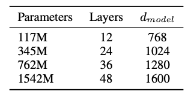
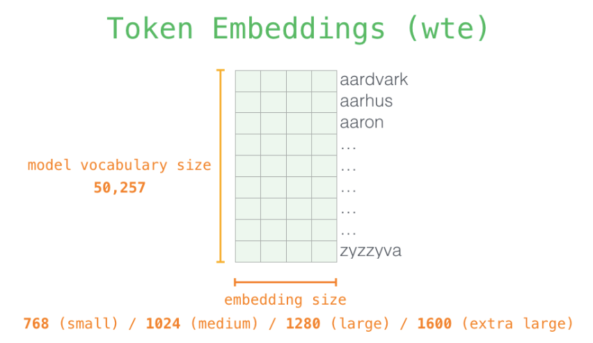
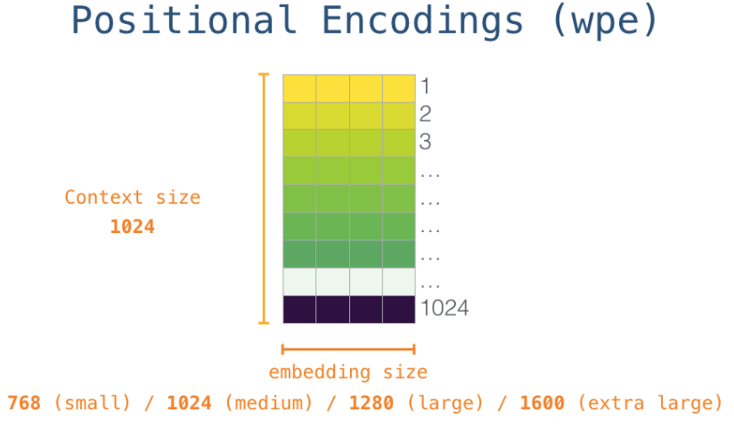
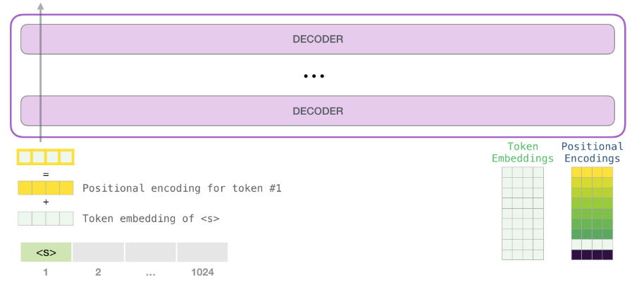
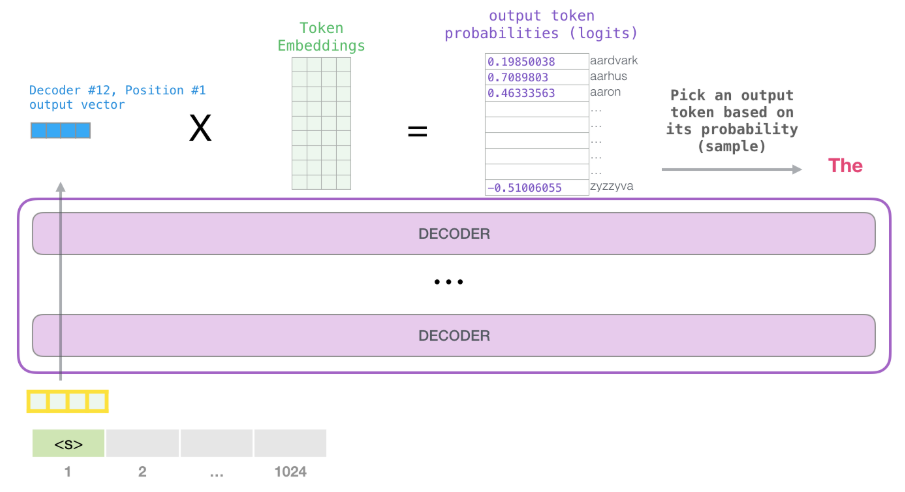

# OpenAI GPT-2

## 1. Background

* 모델이 학습한 데이터에만 잘 작동하는 narrow expert보다 generalist를 원함 → 최근 보다 넓은 범위의 dataset과 여러 과제들에 대한 GLUE benchmark 등이 제안되기 시작
* 기존의 Language Model\(LM\)은 특정 도메인에 치우친 텍스트만 데이터셋으로 활용 \(예: BERT는 BookCorpous\(800M words\) + 위키피디아\(2500M words\)\)
* Common Crawl도 고려해 봤지만, 데이터 퀄리티 이슈가 있고 데이터를 이해할 수 없어서 부적합
* 따라서, 본 논문에서 웹스크래핑으로 WebText 데이터셋을 새로 생성
  * Reddit에서 외부\(outbound\) 링크 중에 karma\(페이스북의 like와 유사\)란 게 있고 karma 3개 이상 받은 글들만 사용
  * Text subset으로 4500만개 링크가 있는데 여기에서 html 파싱, 위키피디아 문서 제거, 중복 처리 등의 전처리 후 8백만 개 문서, 40GB corpus로 간소화
* 또한, BERT와 달리 pre-training+fine-tuning의 조합이 아니라 학습 완료 후 더 이상의 task-specific한 데이터를 fine-tuning하지 않음 \(물론 fine-tuning도 가능하며 BERT와 큰 성능 차이는 없음\)

## 2. Model

### 개요

* **Transformer 디코더만 사용**
  * BERT의 셀프 어텐션이 아닌 Masked 셀프 어텐션 사용
* 총 4개의 모델 제시 \(GPT-2 small, GPT-2 medium, GPT-2 large, GPT-2 extra large\)
  * GPT-2 small은 GPT-1과 파라메터 개수 동일
  * GPT-2 medium은 BERT와 파라메터 개수 동일
  * 약 15억개의 파라메터 개수로 GPT 대비 10배 이상 많음

* 주요 파라메터 변경
  * 어휘 개수: 50,527개
  * Context size: 512 → 1024 토큰
  * Batch size: 512
* 각 residual 계층의 가중치 초기값에 1/sqrt\(N\)으로 스케일링 \(N은 residual 계층들의 개수\)
* Layer Normalization이 원래는 attention 다음이었는데 각 sub-block의 input으로 옮겨짐
* 마지막 셀프 어텐션 블록에 추가 layer normalization 적용
* 각 모델의 learning rate는 WebText의 5%를 떼서 만든 held-out 샘플을 사용하여 수동 조정 →  여전히 WebText에 과소적합\(underfitted\)되었기에 더 오래 학습시키면 더 높은 성능을 얻을 수 있을 거라 기대

### A Deeper Look Inside

* 시작 토큰으로 `<|endoftext|>` 사용. 이제부턴 편의상 `<s>`라고 칭함
* 토큰 임베딩 행렬에서 해당 vocab 검색 후 Positional encoding 결과 가산
*    
* Decoder들을 거쳐 나온 출력 벡터에 토큰 임베딩 행렬을 곱해 출력 토큰의 logit\(확률\) 계산
* 입력 토큰이 Decoder 레이어를 통해 연속적으로 처리된 다음 최종 벡터\(vocab 총 개수\)가 생성됨. 최종 벡터는 top\_1이나 top\_k를 통해 가장 확률이 높은 단어를 다음 단어로 선택
  * top\_1: vocab 중에서 가장 확률이 높은 vocab를 선택 \(top\_k = 1\)
  * top\_k: 상위 k개의 vocab를 선택 후 샘플링

## References

* Paper
  * [https://d4mucfpksywv.cloudfront.net/better-language-models/language-models.pdf](https://d4mucfpksywv.cloudfront.net/better-language-models/language-models.pdf)
* Blog
  * [http://jalammar.github.io/illustrated-gpt2/](http://jalammar.github.io/illustrated-gpt2/)
* Implementation
  * [https://github.com/openai/gpt-2](https://github.com/openai/gpt-2)

