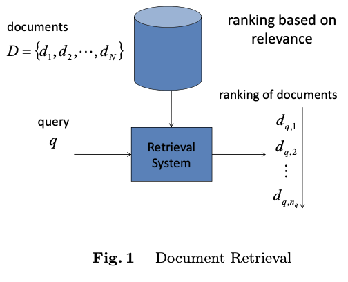
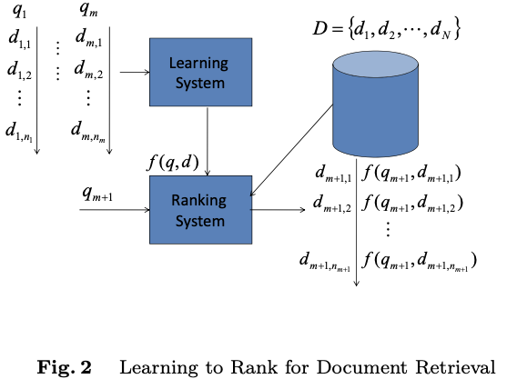
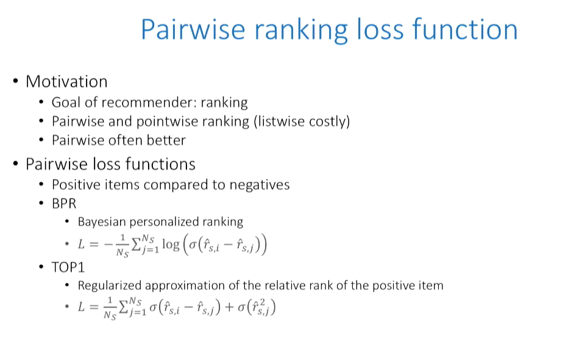
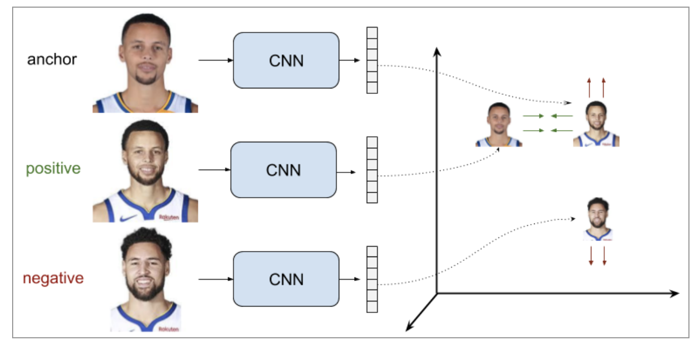

# Learning to Rank


입력 데이터에 대한 정답 스코어를 직접 예측하는 것을 배우는 것이 아닌 리스트의 순서\(order, rank\), 즉 문서의 상대적인 거리를 고려하는 방법으로 **Metric Learning**이라고도 함.


## Definition

* Objective: Learn a function $$f(q,D)$$that produces an optimal permutation $$\pi_{i}$$.
  * $$q$$: 쿼리\(query\), $$D$$ : 문서\(document\)
  * \_\_$$\pi_i$$: $$i$$번째 쿼리에 대한 추천 리스트 \(predicted ranking of document $$d_{i,j}$$\),  예: $$\pi_i = \{d_{i,3}, d_{i,4}, d_{i,2}, d_{i,1}\}$$ 
* Training set: 3-tuples $$(q_{i}, d_{i,j}, y_{i,j})$$로 구성 $$i=1,2,...,m; j = 1,2,...,n_i$$ 
  * $$q_i$$: $$i$$번째 쿼리
  * $$d_{i,j}$$: $$i$$번째 쿼리에 대한 Candidate 문서; $$i$$번째 쿼리에 대응하는 $$n_i$$개의 문서들이 있을 때  $$D_{i}=\{ d_{i,1},d_{i,2},...,d_{i,n_i} \}$$으로 정의한다.
  * $$y_{i,j}$$: Label 데이터로 $$j$$번째 문서가 얼마나 $$i$$번째 쿼리와 연관이 있는지를 나타냄\(relevant\). 이를 상대적인 순위 rank로도 표현할 수 있다.
    * $$y_{i,j} \in \{1, 2, 3, 4, 5\}$$ , 1의 경우 연관이 거의 없고 5의 경우 연관성이 매우 높음
  * OHSUMED 데이터셋 예시
    * $$q_{1}$$: “Are there adverse effects on lipids when progesterone is given with estrogen replacement therapy”
    * $$d_{1,1}$$= \#docid 244338 = “Effects on bone of surgical menopause and estrogen therapy with or without progesterone replacement in cynomolgus monkeys.”
    * $$y_{1,1} = 0$$ = not relevant
  * 각 pair $$(q_{i}, d_{i, j})$$는 실제로는 feature vector $$x_{i,j} = \phi(q_{i}, d_{i, j})$$이므로, 훈련 데이터는 아래와 같이 정의할 수 있다.
    * $$T=\{(\phi(q_{i}, d_{i, j}),y_{i,j})\} = \{(\textbf{x}_{i}, \textbf{y}_{i})\}, \text{by letting } \textbf{x}_i = \{x_{i,1}, x_{i,2} ..., x_{i,n_i}\}$$ 
    * $$\mathbf{y}_i  = r(\mathbf{x}_i)$$ 로 표현하기도 함 \( $$r$$= rank function\)
    * 예시:
      * Matching Feature; Sum of tf\*idf ,Match term Ratio, etc
      * Document-specific Feature
      * Query-specific Feature: 쿼리 길이 등
* Test set: 신규 쿼리 $$q_{m+1}$$과 관련 문서 $$D_{m+1}$$ 로 테스트
*   

### Datasets

* Microsoft Research
  * LETOR 3.0: OHSUMED 데이터셋의 의료 검색 쿼리 및 관련 문서와 2002 년 .gov 웹 페이지 및 관련 쿼리 크롤링 데이터.
  * LETOR 4.0: TREC의 Million Query Track 쿼리와 .gov 웹 페이지의 또 다른 크롤링 인 Gov2의 문서 ID가 포함됨.
  * MSLR-WEB10K/MSLR-WEB30K: Bing 검색 엔진에서 파생 된 10,000/30,000 개의 쿼리 및 관련 문서
* Yahoo
  * Yahoo! Learning to Rank Challenge: 2010년 Learning to Rank Challenge 컴피티션 데이터셋으로 36,000 개의 쿼리와 883,000 개의 문서 ID로 구성
  * 데이터셋 다운로드 시에 학교 이메일 계정 필요
  * [https://webscope.sandbox.yahoo.com/catalog.php?datatype=c](https://webscope.sandbox.yahoo.com/catalog.php?datatype=c)

### Models

#### Pointwise

* $$\phi (q_ {i}, d_ {i, j})$$에 대한 실제 점수를 계산 후 정렬
* 각 query-document pair에 대한 해석 가능한 confidence score 산출 가능
* 상대적인 위치를 고려하지 않는다는 것이 단점
* 가장 간단한 loss function은 $$\sum_{i=1}^{m} (\textbf{x}_i - \textbf{y}_i)^2$$의 형태를 가진다.
* Logistic Regression, MCRank, Prank, OC SVM, Subset Ranking 등

#### Pairwise

* 문서 2개를 비교하여 두 문서 중 어느 문서가 더 높은 순위인지 정함 → 순서 변경을 최소화하는 방향으로 훈련을 수행하기 때문에 문서의 상대적 위치를 더 고려
* 첫 번째 문서의 순위가 두 번째 문서보다 높은지 여부에 대한 레이블 지정 → 즉, 대소 관계만 따지면 되므로 이진 분류 문제로 변경됨
* Objective: $$\mathbf{y}_{i}> \mathbf{y}_{j}$$일때, $$f(\mathbf{x}_{i})>f(\mathbf{x}_{j})$$가 성립하는 ranking function $$f$$를 찾는 것
  * 실제로는 두 개의 입력에 대한 rank가 확실히 차이나게 하기 위해 margin $$\alpha > 0$$을 적용한다.
  * 따라서, negative pair인 경우, $$\max(0, \alpha - f(\mathbf{x}_{i}) + f(\mathbf{x}_{j}))$$를 최소화하면 된다.
  * positive pair의 경우에는 margin이 필요 없으므로, $$f(\mathbf{x}_{j})-  f(\mathbf{x}_{i})$$를 최소화하면 된다.
  * 두 입력 간의 거리를 측정하는 distance function d 적용하면 블로그 [https://gombru.github.io/2019/04/03/ranking\_loss/](https://gombru.github.io/2019/04/03/ranking_loss/) 의 Loss와 동일한 것을 알 수 있다.

    $$L = \left\{\begin{matrix} & d(f(\mathbf{x}_i),f(\mathbf{x}_{pos})) & & if & \text{Positive Pair} \\ & max(0, \alpha - d(f(\mathbf{x}_i),f(\mathbf{x}_{neg}))) & & if & \text{Negative Pair} \end{matrix}\right.$$
* 훈련 데이터 형태: $$(\phi(q_{i},d_{i,j}),\phi(q_{i},d_{i,k}),\{+1,-1\})$$ 
* 참고로, HRNN의 Pairwise Loss function은 이를 변형한 BPR이나 TOP1을 사용한다.

* Ranking SVM, RanBoost, RankNet, GBRank, IR SVM, Lambda Rank, LambdaMART 등
* 추천 도메인뿐 아니라 Siamese Network에서도 활용됨.

#### Tripet

* Learning to Rank에서는 언급되어 있지 않지만 최근에 많이 쓰이고 있는 ranking loss
* $$L = \max(0, \alpha + d(f(\mathbf{x}_i),f(\mathbf{x}_{pos}))-d(f(\mathbf{x}_i),f(\mathbf{x}_{neg})))$$ 
* pairwise loss는 서로 다른 pair 끼리 멀어지는 효과\(push\)만 있지만, triplet은 push 뿐만 아니라 anchor - positive distance를 통해 비슷한 점들이 모이는\(pull\) 효과가 있음
* 단, sampling에 따라 성능 편차가 심하기 때문에 anchor, positive, negative로 이루어진 tripet sampling을 잘 해야 함
* Easy Tripets: $$d(f(\mathbf{x}_i),f(\mathbf{x}_{neg})) > d(f(\mathbf{x}_i),f(\mathbf{x}_{pos})) + \alpha$$ 
  * anchor 샘플에 대응하는 negative 샘플은 임베딩 공간에서 positive 샘플에 이미 충분히 떨어져 있기 때문에 loss는 0
* Hard Tripets: $$d(f(\mathbf{x}_i),f(\mathbf{x}_{neg})) <d(f(\mathbf{x}_i),f(\mathbf{x}_{pos}))$$ 
  * negative 샘플이 positive 샘플보다 anchor에 더 가깝기 때문에 loss는$$\alpha$$보다 큰 양수
* Semi-Hard Tripets: $$d(f(\mathbf{x}_i),f(\mathbf{x}_{pos})) <d(f(\mathbf{x}_i),f(\mathbf{x}_{neg}))<d(f(\mathbf{x}_i),f(\mathbf{x}_{pos})) + \alpha$$ 
  * negative 샘플은 positive 샘플보다 anchor에 더 멀리 있지만 거리가 마진보다 크지 않으므로 loss는 $$\alpha$$보다 작은 양수
* FaceNet 등

 

#### Listwise

* 쿼리의 전체 후보 목록에 대해 예상 순위와 실제 순위를 측정하는 손실 함수를 최적화하여 훈련
* ListNet, ListMLE, AdaRank, SVM MAP, SoftRank, SVM MAP 등

## References

* A Short Introduction to Learning to Rank: [http://times.cs.uiuc.edu/course/598f14/l2r.pdf](http://times.cs.uiuc.edu/course/598f14/l2r.pdf)
* Learning to Rank Overview : [https://wellecks.wordpress.com/2015/01/15/learning-to-rank-overview/](https://wellecks.wordpress.com/2015/01/15/learning-to-rank-overview/)

