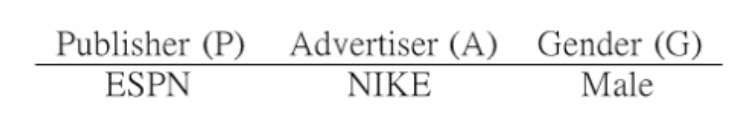
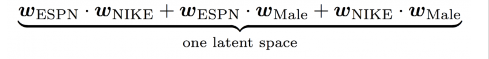
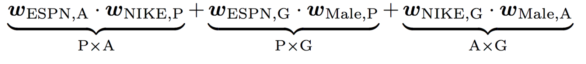

# Recommendation System Overview

## Content-based Filtering\(내용 기반 필터링\)

* item을 feature로 표현 후, item끼리 비슷한지 비교합니다.
* 예: 어벤저스 영화의 장르가 'SF', '액션' 이라면 아이어맨 영화의 장르도 'SF', '액션'이므로 유사

* TF-IDF, Embedding \(Obejct2Vec 등\)
* User-item 상호 작용 정보의 부재로 인한 Cold-start 문제가 없기에 여전히 많이 활용됩니다. 하지만, 과거의 user가 봤던 item만 추천하므로 한계가 분명합니다.

## Collaborative Filtering\(협업 필터링\)

User-item의 상호 작용\(interaction\) 정보를 통해 user가 좋아할 만한 item을 추천합니다. 직관적으로 user-item 상호 작용 정보를 통해 비슷한 user를 찾을 수 있기에, 내가 보지 않았지만 나와 비슷한 user가 봤던 item을 추천하는 것입니다.

* 

#### 분류 방법 1

* Memory-based method
  * K-NN, Correlation Coefficient
* Model-based method
  * Matrix Factorization

#### 분류 방법 2

* User-based 협업 필터링
* Item-based 협업 필터링

#### 협업 필터링의 문제점

* Cold-start problem
* Sparsity
* Popularity bias

## Matrix Factorization

> Matrix factorization models map both users and items to a joint latent factor space of dimensionality f, such that user-item interactions are modeled as inner products in that space.

## **Factorization Machine**

#### **개요**

일반적인 추천 문제들은 user가 행, item이 열, rating이 값으로 이루어진 행렬을 데이터셋으로 하여 Matrix Factorization 기법을 활용하는데, real-world의 다양한 메타데이터 피처\(feature\)들을 그대로 적용하기에는 어려움이 있습니다. Factoriztion Machine\(이하 FM\) 알고리즘은 Matrix Factorization의 개념을 확장하여 메타데이터 피처들을 같이 고려하고 피처 간의 상호 관계\(interaction\)를 선형 계산 복잡도로 자동으로 모델링할 수 있기에, 피처 엔지니어링에 들어가는 노력을 크게 줄일 수 있습니다.

#### Degree-2 Polynomial Mappings\(Poly2\)

다양한 메타데이터 피처를 고려하기 위해 아래 그림처럼 user와 item을 원-핫 인코딩으로 변환하고 추가 피처들을 그대로 concatenate하여 `f(user, item, additional features) = rating` 형태의 선형 회귀\(Linear Regression\) 문제로 변환하여 풀 수 있습니다.

하지만, 추천 문제를 선형 회귀로만 풀려고 하면 피처 간의 상호 관계를 고려할 수 없기에 아래 수식처럼 피처 간의 상호 관계를 모델링하는 항을 추가하여 다항 회귀\(Polynomial Regression\)로 변환해야 합니다.

$$
\hat{y}(\mathbf{x}) = w_{0} + \sum_{i=1}^{d} w_{i} x_{i} + \sum_{i=1}^d \sum_{j=i+1}^d x_{i} x_{j} w_{ij}, \;\; x \in \mathbb{R}^d \tag {1}
$$

$$d$$는 피처 갯수로, $$x$$는 단일 샘플의 피처 벡터를 나타냅니다.

\(Bias 예시: 특정 사용자는 평균적으로 모든 item에 높은 점수를 줄 수도 있습니다.\)

하지만 대부분의 추천 시스템 데이터셋은 희소하기에\(sparse\) cold-start 문제가 있으며, 추가적으로 고려해야 하는 피처들이 많아질 수록 계산이 매우 복잡해집니다. \(예: user가 6만명, item 갯수가 5천개, 추가 피처가 5천개일 경우 70,000x70,000 행렬을 예측해야 합니다.\)

또한, 데이터가 희소한 경우 직관적으로 학습 데이터셋에서는 존재하는 쌍\(pair\)이지만, 테스트 데이터셋에서는 찾을 수 없는 쌍들이 종종 있을 수 있으며, 이러한 경우 뻔한 예측 결과만 출력하게 됩니다.

#### Factorization Machine\(FM\)

FM은 이러한 문제들을 행렬 분해 기법을 활용하여 feature 쌍\(예: user, item\) 간의 상호 관계를 내적\(dot product\)으로 변환하고 수식을 재구성하여 계산 복잡도를 $$O(kd^2)$$에서 $$O(kd)$$로 감소시켰습니다. \(수식 \(2\)에서 추가적인 계산을 거치면 계산 복잡도를 선형으로 감소할 수 있습니다. 자세한 내용은 논문을 참조하세요.\)

$$
\hat{y}(\mathbf{x}) = w_{0} + \sum_{i=1}^{d} w_i x_i + \sum_{i=1}^d\sum_{j=i+1}^d x_{i} x_{j} \langle\mathbf{v}_i, \mathbf{v}_j\rangle \tag{2}
$$

$$
\langle \textbf{v}_i , \textbf{v}_{j} \rangle = \sum_{f=1}^k v_{i,f} v_{j,f},\; k: \text{dimension of latent feature} \tag{3}
$$

위의 모델을 2-way\(degree = 2\) FM이라고 하며, 이를 일반화한 d-way FM도 있지만, 보통 2-way FM를 많이 사용합니다. SageMaker의 FM 또한 2-way FM입니다.

FM이 훈련하는 파라메터 튜플은 \(𝑤0,𝐰,𝐕\) 이며, 의미는 아래와 같습니다.

* 𝑤0∈ℝ: global bias
* 𝐰∈ℝ^𝑑: 피처 벡터 $$x_i$$의 가중치
* 𝐕∈ℝ^\(𝑛×𝑘\): 피처 임베딩 행렬

훈련 방법은 대표적으로 Gradient Descent, ALS\(Alternating Least Square\), MCMC\(Markov Chain Monte Carlo\)가 있으며, AWS에서는 이 중 딥러닝 아키텍처에 기반한 Gradient Descent를 MXNet 프레임워크를 이용하여 훈련합니다.

#### 장점

FM은 위의 수식에서 알 수 있듯이 closed form이며 시간 복잡도가 선형이기 때문에, 다수의 user & item과 메타데이터들이 많은 추천 문제에 적합합니다.

또한, Poly2에서 문제가 되었던 학습 데이터셋에서는 존재하는 쌍\(pair\)이지만, 테스트 데이터셋에서는 찾을 수 없는 쌍들에 대한 대처를 할 수 있습니다.

예를 들어, $$(x_i, x_k)$$가 학습 데이터에 포함되어 있지 않더라도, $$(x_i,x_j)$$와 $$(x_j,x_k)$$가 학습 데이터에 포함되어 있다면 각각의 embedding을 통해 $$v_i, v_j, v_k$$를 모두 학습할 수 있기 때문입니다.

## Field-aware FM

Field-aware FM은 Field의 정보를 넣어 FM을 개선했습니다.

*    

남자라는 특징에 대응하는 임베딩이 FM에서는 한 개 뿐이지만, FFM에서는 남자에 대응하는 field들\(예: 직업, 국적, 영화 등\)을 모두 학습하기에 여러 개의 임베딩을 학습하게 됩니다.

$$
\hat{y}(\mathbf{x}) = w_{0} + \sum_{i=1}^{d} w_i x_i + \sum_{i=1}^d\sum_{j=i+1}^d x_{i} x_{j} \langle\mathbf{v}_{i, F(j)}, , \mathbf{v}_{j, F(i)}\rangle \tag{4}
$$

FFM은 현업에서도 많이 적용하고 있는 유명한 기법이지만, 계산 복잡도와 과적합 이슈로 인해 최근 이를 개선하기 위한 다양한 연구들이 이루어지고 있습니다.

#### Field-aware Probabilistic Embedding Neural Network\(FPENN\)

Variational Auto Encoder\(VAE\)의 아이디어를 가져 와서, 임베딩을 직접 학습하는 것이 아니라 그 임베딩이 따르는 확률 밀도 분포의 파라미터를 추정하는 방법으로 학습합니다. 이렇게 임베딩에 확률적인 진동을 가지게 함으로써 학습시에 포함되는 노이즈에 강건하게 됩니다.

#### Interaction-aware Factorization Machines

Attention + FM

