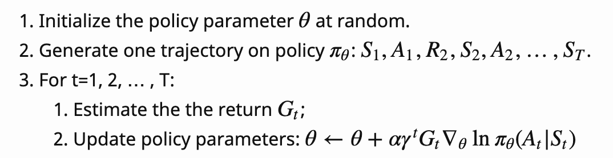
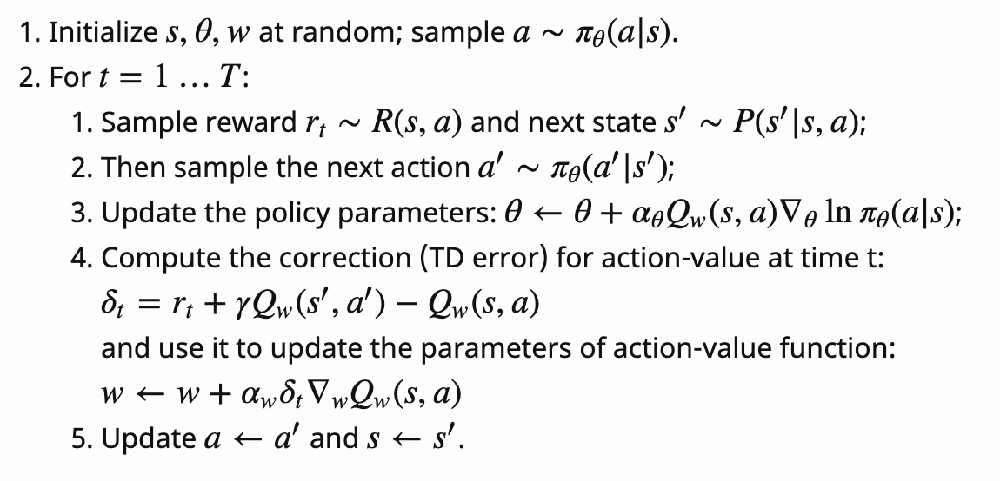
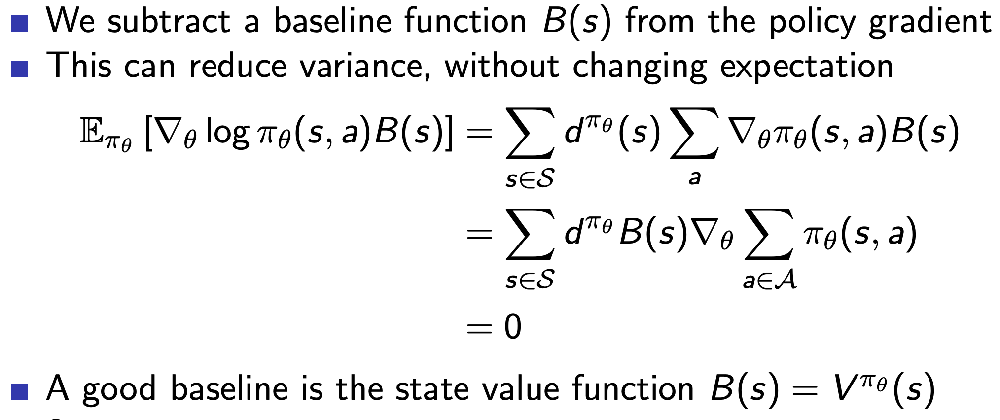

# Policy Gradient Overview

## 1. Policy Gradient Theorem

### Basic Concept

직관적으로 정책\(policy\)의 성능을 증가시키는 방향의 gradient를 구해\(즉, gradient ascent\) 정책을 업데이트할 수 있다. \(alpha: learning rate\)

$$
\theta_{t+1} = \theta_t + \alpha \nabla_\theta J(\theta)
$$

#### 장점

* Better convergence
* Effective in continuous action spaces

#### 단점

* Local optimum
* High variance

### Theorem

목표 함수 _J_의 정의를 \(1\)이라 할 때,

$$
J(\theta) = \sum_{s \in S} d^{\pi}(s)V^{\pi}(s) = \sum_{s \in S}d^{\pi}(s) \sum_{a \in A} \pi_{\theta}(a|s)Q^{\pi}(s, a) \tag {1}
$$

* _d_: s라는 상태에 에이전트가 있을 확률 \(i.e., state distribution\)
* 좀 더 직관적으로 각 상태에서 정책 π에 따라 특정 행동을 취했을 때 받는 Q함수의 합

_임의의 미분 가능한 policy πθ\(s,a\)의 J\(θ\)의 미분을 아래와 같이 나타낼 수 있으며, 이는 \(행동\) 가치 함수인 Q함수와 πθ의 gradient를 곱한 기댓값\(expected value\)으로 analytical하게 계산할 수 있다는 것이다._

$$
\nabla_\theta J(\theta) = \mathbb{E}_\pi [Q^\pi(s, a) \nabla_\theta \log \pi_\theta(a \vert s)] \tag {2}
$$

### Why?

Likelihood ratio trick에 의해 π\_θ의 미분은 \(3\)과 같이 표현 가능하다. \(log\(x\)의 미분은 1/x인 걸 생각하면 간단하다.\)

$$
\begin{aligned} \nabla_\theta \pi_\theta(a \vert s) &= \pi_\theta(a \vert s) \dfrac{\nabla_\theta \pi_\theta(a \vert s)}{\pi_\theta(a \vert s)} \\ &= \pi_\theta(a \vert s)\nabla_\theta \log \pi_\theta(a \vert s) \tag{3} \end{aligned}
$$

따라서, \(1\)의 미분은 아래와 같이 전개 가능하며, 두 sigma term이 의미하는 것은 바로 에이전트가 어떤 상태 s에서 행동 a를 선택할 확률의 합산을 의미하기 때문에 기댓값으로 풀어쓸 수 있다.

$$
\begin{aligned}  \nabla_\theta J(\theta) &= \sum_{s \in S}d^{\pi}(s) \sum_{a \in A} \nabla_\theta\pi_{\theta}(a|s)Q^{\pi}(s, a) \\ &= \sum_{s \in S}d^{\pi}(s) \sum_{a \in A} \pi_\theta(a \vert s) \nabla_\theta \log \pi_\theta(a \vert s) Q^{\pi}(s, a) \\ &= \mathbb{E}_\pi [Q^\pi(s, a) \nabla_\theta \log \pi_\theta(a \vert s)] & \scriptstyle{\text{; Because } \mathbb{E}_\pi \text{ refers } \mathbb{E}_{s \sim d_\pi, a \sim \pi_\theta}} \tag{4} \end{aligned}
$$

## 2. Algorithms

### REINFORCE\(Monte-Carlo policy gradient\)

\(4\)에서 우리는 ground-truth Q함수를 모르지만, return G\_t를 무수히 많이 샘플링하여 Q함수를 근사할 수 있다는 사실을 알고 있다 \(즉, return G\_t가 Q의 unbiased estimate\).

이를 활용해서 episode 샘플 내에서 몬테카를로 기법을 통해 산출한 return G\_t로 policy parameter θ를 업데이트하는 기법이다. 참고로, 수식 맨 아랫줄의 의미는 기댓값을 sampling으로 대체하겠다는 것이다.

$$
\begin{aligned} \nabla_\theta J(\theta)  &= \mathbb{E}_\pi [Q^\pi(s, a) \nabla_\theta \log \pi_\theta(a \vert s)]  & \\  &= \mathbb{E}_\pi [{\color{red}G_t }\nabla_\theta \log \pi_\theta(A_t \vert S_t)] & \scriptstyle{\text{; Because } Q^\pi(S_t, A_t) = \mathbb{E}_\pi[G_t \vert S_t, A_t]} & \\ &\approx \sum_{t=0}^{T-1} {\color{red}G_t }\nabla_\theta \log \pi_\theta(A_t \vert S_t) \tag{5} \end{aligned}
$$

알고리즘을 요약하면 아래와 같다.



* policy parameter θ를 랜덤하게 초기화
* policy에 따른 episode 샘플 생성. \(episode = trajectory = step\)
* 각 episode마다 policy parameter θ를 gradient ascent로 업데이트 \(action에 따른 return이 클수록 좋은 action이기 때문에 gradient를 증가시킴\)

REINFORCE는 policy gradient 기반 알고리즘의 baseline이지만, 아래와 같은 고질적인 단점들이 있기에 이후 알고리즘들에서 이를 개선하고 있다.

* 정책 gradient의 high variance \(몬테카를로 방법의 고질적인 단점\)
* 샘플 효율성\(sample efficiency\)이 좋지 않음 \(episode를 완료해야 계산 가능\)

#### Code Snippet \(PyTorch\)

Cartpool 예제이며, 코드에서 \(5\)의 수식이 `loss = -torch.log(prob) * R`로 간단하게 표현 가능함을 알 수 있다.

출처: [https://github.com/seungeunrho/minimalRL/blob/master/REINFORCE.py](https://github.com/seungeunrho/minimalRL/blob/master/REINFORCE.py)

```python
import gym
import torch
import torch.nn as nn
import torch.nn.functional as F
import torch.optim as optim
from torch.distributions import Categorical

#Hyperparameters
learning_rate = 0.0002
gamma         = 0.98

# Policy Network: 4개의 state를 입력으로 받아서 2개의 action 출력
class Policy(nn.Module):
    def __init__(self):
        super(Policy, self).__init__()
        self.data = []

        self.fc1 = nn.Linear(4, 128)
        self.fc2 = nn.Linear(128, 2)
        self.optimizer = optim.Adam(self.parameters(), lr=learning_rate)

    def forward(self, x):
        x = F.relu(self.fc1(x))
        x = F.softmax(self.fc2(x), dim=0)
        return x

    def put_data(self, item):
        self.data.append(item)

    def train_net(self):
        R = 0
        self.optimizer.zero_grad()
        for r, prob in self.data[::-1]:
            R = r + gamma * R # discounted reward
            loss = -torch.log(prob) * R
            loss.backward()
        self.optimizer.step()
        self.data = []

def main():
    env = gym.make('CartPole-v1')
    pi = Policy()
    score = 0.0
    print_interval = 20


    for n_epi in range(10000):
        s = env.reset()
        done = False

        while not done: # CartPole-v1 forced to terminates at 500 step.

            prob = pi(torch.from_numpy(s).float())
            m = Categorical(prob)
            a = m.sample() # prob에 따라 discrete action 선택
            s_prime, r, done, info = env.step(a.item())
            pi.put_data((r,prob[a]))
            s = s_prime
            score += r

        pi.train_net()

        if n_epi%print_interval==0 and n_epi!=0:
            print("# of episode :{}, avg score : {}".format(n_epi, score/print_interval))
            score = 0.0
    env.close()

if __name__ == '__main__':
    main()
```

### Q Actor-Critic


REINFORCE + DQN \(비유: 운동선수가 혼자 학습하는 대신, 코치의 도움을 받아 학습하는 것\)


만약 Return G\_t 대신 Q함수를 파라메터 w로 근사한 Q\_w로 대체한다면? 기존에 정책 파라메터 θ에 추가로 가치 함수 파라메터 w를 학습해야 하므로 2개의 뉴럴 네트워크를 사용해야 한다.

* Actor: 정책 신경망으로 critic에서 정한 방향대로 policy parameter θ를 업데이트
* Critic: 가치 신경망으로 action-value parameter w를 업데이트 \(가장 기본적인 방법은 TD\(0\) 방법으로 업데이트\)

$$
\begin{aligned} \nabla_\theta J(\theta) &= \mathbb{E}_\pi [{\color{red}Q_w(s,a)} \nabla_\theta \log \pi_\theta(A_t \vert S_t)] \tag{6} \end{aligned}
$$

알고리즘을 요약하면 아래와 같다.



* 파라메터 초기화 후 policy π에 기반해 action을 샘플링
* 각 tracjectory에 대해서 policy parameter θ 업데이트 → TD error delta 업데이트 → action-value parameter w 업데이트 반복

$$
\delta_t = r_t + \gamma Q_w(s', a') - Q_w(s, a) \tag{7}
$$

Loss Function

* Actor: Cross entropy \* TD error
* Critic: MSE of TD error;

### A2C\(Advantage Actor-Critic\)

여전히 gradient에 대한 variance가 더 크기 때문에 state에 대한 임의의 함수인 baseline 함수 B\(s\)를 Q함수에서 빼는 방법이다.

* 직관적 예시
  * 어떤 Q함수가 100만이고 또다른 Q함수가 99,9900일 때 절대적인 차이보다는 상대적인 차이인 100이 더 빠르게 수렴할 수 있음

아래 장표 수식에서 B\(s\)는 action a와 관계가 없기 때문에 action에 대한 sigma term의 밖으로 뺄 수 있다. 모든 action에 대한 policy의 합은 1이므로, 이를 θ에 대해 미분하면 θ와는 관계가 없기 때문에 0이다.



여기에서 Base 함수는 state에 대한 임의의 함수이므로 가치 함수\(V\)로 치환 가능하며, Q-V를 advantage 함수라 한다.

$$
A^\pi(s, a) = Q^\pi(s, a) - V^\pi(s) \tag{8}
$$

B\(s\), 즉 V에 대한 기댓값이 0이므로 Q - V로 대체해도 gradient 값은 변동하지 않는다. 따라서 \(6\)의 gradient 업데이트 수식을 아래와 같이 대체할 수 있다.

$$
\begin{aligned} \nabla_\theta J(\theta) &= \mathbb{E}_\pi [{\color{red}A_w(s, a)} \nabla_\theta \log \pi_\theta(A_t \vert S_t)] \tag{9} \end{aligned}
$$

### TD Actor-Critic

Advantage Actor Critic은 v에 대한 파라메터까지 업데이트해야 하기 때문에, 세 쌍의 파라메터가 필요한 상황이다. 하지만, TD error \(10\)가 \(11\)에 따라 Advantage 함수의 unbiased estimator이므로, A대신 TD error로 대체 가능하다.

unbiased estimator: 표본\(sample\)에서 산출한 예측값의 기댓값이 모집단의 모수와 동일한 것

$$
\delta^\pi = r + \gamma V^\pi(s') - V^\pi(s) \tag{10}
$$

$$
\begin{aligned} \mathbb{E}_\pi [\delta^\pi \vert s, a] &= \mathbb{E}_\pi [r + \gamma V^\pi(s') \vert s,a] - V^\pi(s) & \\ &= Q^\pi(s,a) - V^\pi(s) = A^\pi(s,a) \end{aligned} \tag{11}
$$

즉, \(10\)에 따라 Q에 대한 파라메터가 더 이상 필요하지 않게 되어 두 쌍의 파라메터만으로 gradient를 업데이트할 수 있다.

$$
\begin{aligned} \nabla_\theta J(\theta) &= \mathbb{E}_\pi [{\color{red}\delta} \nabla_\theta \log \pi_\theta(A_t \vert S_t)] \tag{12} \end{aligned}
$$

지금까지 소개한 알고리즘들의 θ에 대한 목표함수 J의 미분은 다음과 같다.

$$
\begin{aligned} \nabla_\theta J(\theta)  &= \mathbb{E}_\pi [{\color{red}G_t }\nabla_\theta \log \pi_\theta(A_t \vert S_t)] & \scriptstyle{\text{; REINFORCE }} & \\  &= \mathbb{E}_\pi [{\color{red}Q_w(s,a) }\nabla_\theta \log \pi_\theta(A_t \vert S_t)] & \scriptstyle{\text{; Q Actor-Critic }}  & \\  &= \mathbb{E}_\pi [{\color{red}A_w(s,a) }\nabla_\theta \log \pi_\theta(A_t \vert S_t)] & \scriptstyle{\text{; Advantage Actor-Critic }}  & \\  &= \mathbb{E}_\pi [{\color{red}\delta }\nabla_\theta \log \pi_\theta(A_t \vert S_t)] & \scriptstyle{\text{; TD Actor-Critic }} \tag{13}  \end{aligned}
$$

딥러닝 프레임워크들이 자동 미분을 지원하므로 구현 또한 간단하다.

### A3C\(Asynchronous Advantage Actor-Critic\)

Policy Gradient 기반 방법들은 expoding gradient를 피하기 위해 대체로 learning rate를 보수적으로 설정하며, on-policy의 한계\(정책이 계속 변경되는데, 정책 변경 때마다 새로운 샘플을 수집하며, 오래된 샘플은 재사용할 수 없음\)로 샘플 효율이 낮기에 학습에 필요한 step 횟수가 매우 많다. \(예: 수천만 번의 step\)

이를 에이전트\(actor-learner\)를 병렬적으로 학습하면서 비동기적으로 global parameter를 업데이트하는 방식으로 개선할 수 있다.

알고리즘은 다음과 같다.

* 동기화를 위한 global 파라메터\(θ, w\)의 생성과 thread용 파라메터를 학습하기 위한 여러 개의 환경+actor learner 생성
* 각 actor learner는 일정 timestep 동안 샘플 수집 \(i: timestep index\)

$$R \leftarrow r_{i} + \gamma R \\d\theta \leftarrow d\theta + \nabla_{\theta'} \log \pi_{\theta'} (a_{i} | s_{i}) (R - V_{w'}(s_{i})) \\dw \leftarrow dw + 2(R - V_{w'}(s_{i})) \nabla_{w'}(R - V_{w'}(s_{i}))$$

* 일정 timestep 이후, 각 actor learner는 global 파라메터 θ, w를 d\_θ, dw로 asynchronous하게 업데이트 → global 파라메터로 각 actor learner의 파라메터 업데이트

### TPRO\(Trust Region Policy Optimization\)

A2C는 gradient의 분산이 큰 문제점을 개선하였고 on-line 업데이트가 가능하나, on-policy 방법이기 때문에 샘플 효율성이 좋지 않다. 하지만, Importance sampling을 활용하면 behavior 정책과 target 정책이 동일할 필요가 없기 때문에 다른 정책에서 발생시킨 샘플로 target 정책을 업데이트할 수 있으며 **이는 이전 정책의 샘플을 재사용할 수 있다는 의미이다. 즉, exploration을 지속하면서도 optimal한 정책을 학습할 수 있다.**

$$
\begin{aligned} J(\theta) &= \sum_{s \in S} \rho^{\pi_{\theta_{\text{old}}}} \sum_{a \in A} \big( \pi_{\theta} (a|s) \hat{A}_{\theta_{\text{old}}}(s, a) \big) \\  &= \sum_{s \in S} \rho^{\pi_{\theta_{\text{old}}}} \sum_{a \in A} \big( \color{red}{\beta(a|s)} \frac{\pi_{\theta}(a|s)}{ \color{red}{ \beta(a|s)}} \hat{A}_{\theta_{\text{old}}}(s, a) \big) & \scriptstyle{ \text{; Importance Sampling}} \\ &= \mathbb{E}_{s \sim \rho^{\pi_{\theta_{\text{old}}}}, \alpha \sim \beta} \big[ \frac{\pi_{\theta}(a|s)}{\beta(a|s)} \hat{A}_{\theta_{\text{old}}}(s, a) \big] \tag{14} \end{aligned}
$$

TRPO는 \(14\)의 수식에서 behavior 정책에 해당하는 beta를 이전 정책을 뜻하는 π\_old로 변경하고, policy 업데이트 크기를 제한하기 위해 기존 정책과 새로운 정책 사이의 KL Divergence를 δ 내로 제한하는 제약에 따라 목적 함수 J\(θ\)를 최대화한다.

$$
J(\theta) = \mathbb{E}_{s \sim \rho^{\pi_{\theta_\text{old}}}, a \sim \pi_{\theta_\text{old}}} \big[ \frac{\pi_\theta(a \vert s)}{\pi_{\theta_\text{old}}(a \vert s)} \hat{A}_{\theta_\text{old}}(s, a) \big] \tag{15}
$$

$$
\mathbb{E}_{s \sim \rho^{\pi_{\theta_\text{old}}}} [D_\text{KL}(\pi_{\theta_\text{old}}(.\vert s) \| \pi_\theta(.\vert s)] \leq \delta \tag{16}
$$

상기 형태를 constrainted form이라고 하며, 이를 penalized form으로도 변경할 수 있다. 다만, TPRO는 KL Divergence constraint form의 second-order approximation이 필요하므로 계산이 복잡하다. \(수식 \(17\) 참조\)

$$
\overline{D}_\mathrm{KL} (\theta_\mathrm{old}, \theta) \approx \frac{1}{2}(\theta - \theta_\mathrm{old})^T A(\theta - \theta_\mathrm{old}), \\ A_{ij} = \frac{\partial}{\partial \theta_i} \frac{\partial}{\partial \theta_j} \overline{D}_\mathrm{KL}(\theta_\mathrm{old}, \theta) \tag{17}
$$


### PPO\(Proximal Policy Optimization\)


현업에서 가장 많이 쓰이는 SOTA 알고리즘


TRPO에서 제안한 Trust Region Constraint는 계산량이 매우 복잡하기 때문에\(second order\), 이를 근사해서 간단하게 풀 수 있다. TRPO의 목적 함수를 다시 살펴보면, Importance sampling을 통해 θ를 직접적으로 업데이트하지 않고, θ\_old와 θ의 비율을 통해 정책 업데이트 비율을 조정한다.

$$
J^\text{TRPO} (\theta) = \mathbb{E_t} [ r_t(\theta) \hat{A}_{\theta_\text{old}}(s, a) ], \text{ where } r_t(\theta) = \frac{\pi_\theta(a \vert s)}{\pi_{\theta_\text{old}}(a \vert s)} \tag{18}
$$

TRPO는 수식처럼 θ\_old와 θ 사이의 거리에 대한 제한이 없다면 정책 업데이트 비율이 매우 커질 수 있기에\(즉, 불안정성을 초래할 수 있기 때문에\) KL Divergence로 제약 조건을 부여한다.

PPO는 이를 간소화하여 1\) r\(θ\)를 1 주위의 작은 간격 \(\[1−ϵ, 1 + ϵ\]\)으로 유지하여 제약 조건을 부여하거나, 2\) KL Divergence를 간소화하여 first order로 전개한다.

#### Clipped Surrogate Objective

$$
J^\text{CLIP} (\theta) = \mathbb{E_t} [ \min( r_t(\theta) \hat{A}_{\theta_\text{old}}(s, a), \text{clip}(r_t(\theta), 1 - \epsilon, 1 + \epsilon) \hat{A}_{\theta_\text{old}}(s, a))] \tag{19}
$$

r은 1-epsilon, 1+epsilon 사이로 clipping을 하고\(보통 0.1이나 0.2로 설정\) 목적 함수는 원래 값과 clipping된 값들 중 작은 값\(min\)을 취하기 때문에, policy update를 한꺼번에 많이 하지 않는다. \(아래 그림 참조\)

예를 들어 advantage가 양수라면, 행동을 더 자주한다는 뜻이고\(즉 π\(a\|s\)가 증가\) 이에 따라 목적 함수도 증가하지만, min 항으로 인해 목적 함수의 증가가 특정값으로 제한된다.


알고리즘은 다음과 같다.

* timestep T만큼 policy를 돌린다.
* 모든 timestep에 대해 advantage function을 계산한다.
* 몇몇 epoch에 대해 SGD를 수행한다.


#### Adaptive KL Penalty

논문에서 제시한 또다른 방법으로 기본적인 목적 함수는 TRPO와 유사하나, second order가 아닌 first order로 간소화하였다. KL divergence가 일정 이상 크면\(1.5\*delta\) beta를 증가시키고 \(policy가 많이 변동했다는 것을 의미하기에 더 큰 penalty를 주기 위해\), 반대로 KL divergence가 일정 이상 작으면 beta를 감소시킨다. \(policy가 적게 변동했다는 것을 의미하기에 더 작은 penalty를 주기 위해\)


## References

* Blog
  * [https://medium.com/@jonathan\_hui/rl-policy-gradients-explained-9b13b688b146](https://medium.com/@jonathan_hui/rl-policy-gradients-explained-9b13b688b146)
  * [https://lilianweng.github.io/lil-log/2018/04/08/policy-gradient-algorithms.html](https://lilianweng.github.io/lil-log/2018/04/08/policy-gradient-algorithms.html)
* Video Clip
  * [https://www.youtube.com/watch?v=2YFBordM1fA](https://www.youtube.com/watch?v=2YFBordM1fA)
  * [https://www.youtube.com/watch?v=L-QYXtJmXrc](https://www.youtube.com/watch?v=L-QYXtJmXrc)

