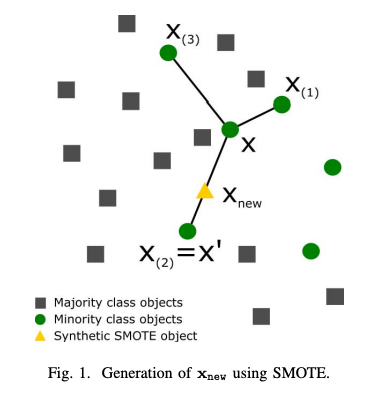
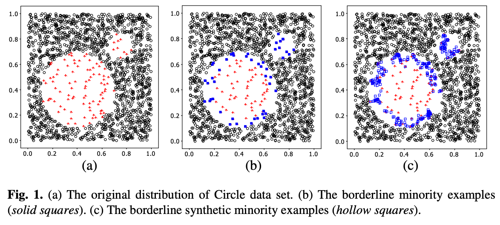
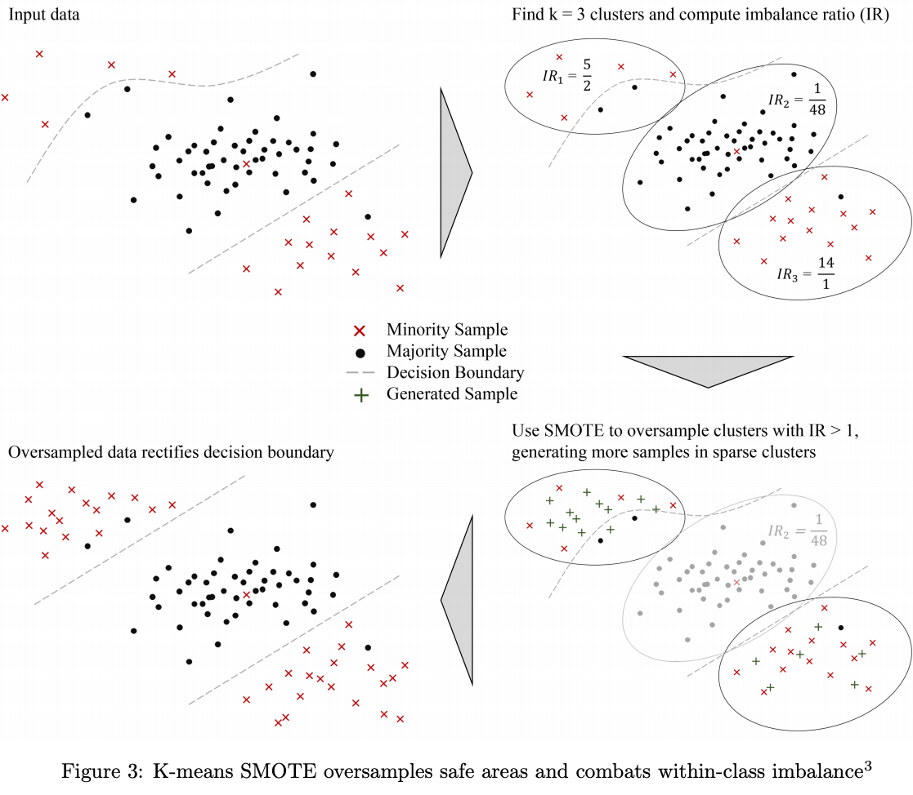

# Oversampling Basic (SMOTE variants)

## Notation

$$\begin{aligned} S &= \{(x_i, y_i)\},\; i = 1, \dots, m \text{ (m examples)} \\ S_{min} &= \text{the set of minority class examples} \\ S_{maj} &= \text{the set of majority class examples} \\ m_s &= |S_{min}| = \text{the number of minority class examples} \\ m_l &= |S_{maj}| = \text{the number of majority class examples} \\ \end{aligned}$$

## SMOTE (Synthetic Minority Oversampling Technique)

소수 범주에 속하는 데이터 샘플과 가장 가까운 소수 범주의 데이터 샘플들을 K-nearest neighbor(K-NN)으로 찾은 후, 보간(interpolation)을 이용하여 새로운 합성(synthetic) 샘플을 생성하는 방식입니다.

### Algorithm

* $$S_{min}$$에 속하는 데이터들 중 임의의 샘플 포인트 $$x_i$$에 대해 K-NN 을 수행합니다.
* K개의 최근접 이웃 샘플들 중 임의의 샘플을 랜덤하게 선택합니다. ($$x_{zi}$$)
* N개의 합성 샘플들을 샘플 포인트 $$x_{i}$$와 $$x_{zi}$$ 사이에서 랜덤하게 생성합니다. 매우 간단한 수식이라 그림 한 장으로 쉽게 이해할 수 있습니다.

$$
x_{new} = x_i + \lambda \times (x_{zi} - x_i), \; \lambda \in [0,1]
$$

SMOTE는 oversampling을 간단히 적용할 수 있는 baseline이지만, 다수 범주의 데이터 분포를 전혀 고려하지 않고 소수 범주에 속하는 데이터들만 보간하므로 다수 범주의 데이터들과 간섭하게 되는 overlapping이 발생합니다.

이를 해결하기 위해 Borderline SMOTE, ADASYN과 같은 SMOTE의 개선 알고리즘들이나 oversampling과 undersampling 기법을 결합하여 (aka hybrid sampling) 사용할 수 있습니다.

## Borderline SMOTE

Decision boundary에 속하는 소수 범주의 데이터만 oversampling하는 방법입니다.

### Algorithm

* k개의 최근접 이웃 샘플들 중 임의의 샘플을 랜덤하게 선택합니다. SMOTE와 달리, k개의 최근접 이웃 샘플들은\
  $$S_{min}, S_{maj}$$에 상관하지 않습니다.
* K-NN 중에서 $$S_{maj}$$에 속하는 샘플들의 비중에 따라 DANGER instance에 속하는 $$x_i$$만 선택합니다. k개의 최근접 이웃들 사이에 존재하는 majority 샘플들의 개수를 $$\hat{k}$$라고 할 때, Borderline SMOTE는 아래 조건에 따라 세 가지 인스턴스를 구별합니다.
  * DANGER instance
    * 대부분의 최근접 이웃들이 다수 범주; $$k/2 \leq \hat{k} < k$$
  * SAFE instance
    * 대부분의 최근접 이웃들이 소수 범주; $$0 \leq \hat{k} < k/2$$
  * Noise instance
    * 모든 최근접 이웃들이 다수 범주; $$\hat{k} = k$$
* 보간하는 방법은 SMOTE와 동일합니다.

## ADASYN (Adaptive Synthetic Sampling)

SMOTE, Borderline SMOTE는 모두 각 샘플 당 합성하는 샘플들의 개수가 모두 동일합니다. 즉, 여전히 데이터 분포를 고려하지 않기에 실제 현업에 곧바로 적용하기에는 많은 위험이 따릅니다. ADASYN은 이를 해결하기 위해 데이터의 밀도 분포를 계산하여 합성 샘플들의 수를 동적으로 조절합니다.

### Algorithm

* $$S_{min}$$에 속하는 총 합성 데이터의 수를 계산합니다.
  * $$G = (|S_{maj}| - |S_{min}|) \times \beta, \; \beta \in [0,1]$$ ; beta는 합성 데이터 생성 후의 balance level을 조절하는 하이퍼라라메터로 beta = 1인 경우 균형 데이터를 의미합니다.
* $$S_{min}$$에 속하는 각 샘플 $$x_i$$에 대한 최근접 이웃들을 찾고 그 비율을 계산합니다.
  * $$\Gamma_i = \dfrac{\Delta_i/k}{Z}, \; i = 1, \dots , |S_{min}|$$&#x20;
  * $$\Delta_i$$_:_ $$x_i$$의 최근접 이웃 중에서 $$S_{maj}$$에 속하는 샘플들의 개수, $$Z$$: $$\Gamma_i$$가 확률 밀도 함수(PDF)가 되도록 하는 정규화 상수
* $$S_{min}$$에 속하는 샘플들 중 한 샘플 포인트 $$x_i$$에 대해 합성 데이터 샘플의 개수를 동적으로 계산합니다; $$g_i = \Gamma_i \times G$$
* 보간 방법은 SMOTE와 동일합니다. 단, $$x_i$$에 대해 $$N$$개의 합성 데이터가 아닌 $$g_i$$개의 합성 데이터를 보간합니다.

## K-Means SMOTE

K-Means 클러스터링 수행 후, 다수 범주의 데이터가 포함된 클러스터는 합성 데이터를 생성하지 않는 방법입니다. 알고리즘 또한 매우 간단합니다.

### Algorithm

* 전체 데이터에 대해 K-Means 클러스터링을 수행합니다.
* 다수 범주의 데이터가 포함된 클러스터는 oversampling 대상에서 제외합니다.
* 소수 범주의 데이터만 존재하는 클러스터에 대해 SMOTE로 합성 데이터를 생성합니다.
