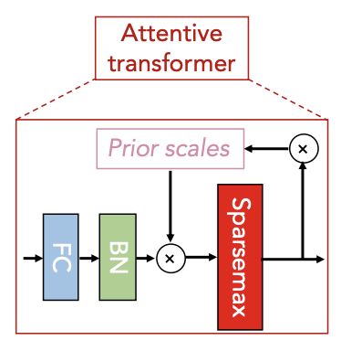

# TabNet Overview

## 1. 들어가기 전

TabNet은 tabular 데이터의 훈련에 맞게 설계된 딥러닝 기반 네트워크입니다. 종래 tabular data에서의 딥러닝은 XGBoost/LightGBM/CatBoost같은 Gradient Boosting Tree 대비 성능이 떨어졌고 비용도 많이 들기에 이점이 없었죠. \(물론 몇몇 예외들이 있습니다. 대표적인 예외는 100만 달러의 상금이 걸린 Netflix 영화 추천 문제에서 우승을 차지한 BellKor팀의 멤버인 Michael Jahrer의 Autoencoder 기반 딥러닝 아키텍처가 Porto Seguro 챌린지에서 Private Leaderboard \(LB\) 1위를 차지했었습니다. 딥러닝 단일 모델은 아니지만, 딥러닝 기반 모델이 주요 컨셉이고 이를 위한 RankGauss normalization 기법도 눈길을 끌었습니다; 참조: [https://www.kaggle.com/c/porto-seguro-safe-driver-prediction/discussion/44629](https://www.kaggle.com/c/porto-seguro-safe-driver-prediction/discussion/44629)\)

하지만 2019년에 구글에서 TabNet을 발표하고 GCP의 빌트인 알고리즘으로 TabNet이 내장되면서, 저 또한 관심을 가지게 되었기에 TabNet에 대해 간단히 리뷰해 보겠습니다.

## 2. Overview

### Main Concept

TabNet의 주요 컨셉은 바로 input feature에 대해 훈련 가능한 마스크\(Trainable Mask\)로 Sparse Feature selection을 수행하는 것입니다. 다시 말해, TabNet의 Feature selection은 특정 feature들만 선택하는 것이 아닌, 마치 Linear Regression처럼 각 feature에 가중치를 부여하는 것입니다. 즉, 설명 가능한\(explainable\) 모델이 되는 것입니다. \(아래 그림 참조\)


Sparse Feature selection 용어가 등장하는 시점에서, 훈련 가능한 마스크는 dense한 마스크가 아닌 sparse한 마스크가 되어야 한다는 사실을 직관적으로 이해할 수 있습니다. 하지만, input feature의 차원이 많을 수록 훈련 비용이 증가하고 훈련이 어렵겠죠. \(이는 TabNet뿐만이 아닌 딥러닝 기반 네트워크의 문제입니다. 괜히 쉽게 해결할 수 있는 문제를 훨씬 복잡하게 만드는...\) 특히 현업에서는 수천 개 이상의 feature들로 구성된 데이터셋도 종종 접할 수 있는데 이 경우에는 TabNet을 적용하는 것은 좋은 선택이 아닙니다.

### AutoEncoder

TabNet의 구조는 Encoder\(인코더\)-Decoder\(디코더\)를 거쳐, 결측값들을 예측할 수 있는 Autoencoder 구조입니다. 따라서, 데이터셋에 결측값들이 포함되어도 별도의 전처리 없이 값들을 채울 수 있습니다. 이 부분은 나중에 다시 살펴 보도록 하고 우선 Encoder 부를 자세히 살펴 보겠습니다.

## 3. Encoder

### Encoder Overview

인코더는 여러 Desicion Step\(이하 Step들로 구성되며, Step 내의 두 가지 주요 블록들은 Feature transformer 블록과 Attentive transformer 블록입니다. 그리고 각 Step에서 가장 중요한 output이 \(Sparse\) Mask입니다.

좀 더 자세히 기술하자면, Feature transformer 블록에서 임베딩\(embedding\)을 수행하고, Attentive transformer 블록에서 trainable Mask를 생성합니다. 이 Mask는 3가지 용도로 활용됩니다. 1\) Feature Importance를 계산, 2\) 이전 Step의 Feature에 곱하여 Masked Feature 생성, 3\) 다음 Step의 Mask에서 적용할 Prior scale term 계산

Masked Feature는 다음 Step의 Input feature가 되며, 이전 step에서 사용되었던 Mask의 정보를 피드백하기에 Feature의 재사용 빈도를 제어할 수 있습니다.

논문의 그림과 위의 설명만으로는 감이 잘 잡히지 않을 수 있으니 각 Step의 네트워크를 좀 더 자세히 살펴 보겠습니다. 또한, Google에서 공개한 구현 코드가 존재하고 코드가 200라인 남짓이라 코드가 복잡하지 않으니, 코드와 같이 확인해 보면 더 좋습니다. \(공식 구현 코드: [https://github.com/google-research/google-research/blob/master/tabnet/tabnet\_model.py](https://github.com/google-research/google-research/blob/master/tabnet/tabnet_model.py)\)


* Input Feature의 dimension은 \[\# batch x \# of features\] 입니다. 매 Step 마다 반복하기 전 Initial Step \(Step 0\)에서는 별도의 Mask Feature 없이 Batch Normalization\(이하 BN\)만 수행합니다.
  * 참고로, 실제로 구현된 BN은 Ghost BN입니다.  Ghost BN은 전체가 아닌 샘플링 데이터에 대해서만 BN을 수행합니다.
* Feature Transformer 블록에서 인코딩을 수행합니다.
  * Step ≥ 1인 경우, 인코딩된 결과에서 ReLU layer를 거쳐 해당 step의 Decision output을 생성합니다. 향후, 각 step의 Decision output의 결과를 합산하여 overall decision 임베딩\($$\mathbf{d_{out}}$$\)을 생성할 수 있고, 이 임베딩이 FC layer를 거치면 최종 output \(classification/regression 예측 결과; $$\hat{y}$$\)이 산출됩니다.
  * $$\mathbf{d_{out}} = \sum_{i=1}^{N_{steps}} \text{ReLU}(\mathbf{d[i]}), \; \hat{y} = \mathbf{W_{final}d_{out}}$$
  * 또한, ReLU layer의 결과에서 \#hidden unit 채널의 값들을 모두 합산하여 해당 step의 Feature importance를 산출할 수 있습니다. 향후, 각 step의 Feature importance의 결과를 합산하면 최종 Feature importance\(Fig 4\(a\)의 Feature Attributes\)를 산출할 수 있습니다.
* 인코딩된 결과는 Attentive transformer 블록을 거쳐 Mask를 생성합니다. Mask에 Feature를 곱하여 Feature selection이 수행되기 때문에 Mask의 차원은 \[\# batch x \# of feature\] 입니다.
  * Attentive transformer 블록 내에서 FC → BN → Sparsemax를 순차적으로 수행하면서 Mask를 생성합니다. 이에 대한 자세한 내용을 아래에서 살펴보겠습니다.
* Mask는 이전 Step의 Feature와 곱하여 Masked Feature를 생성합니다. Sparsemax 함수를 거쳤기 때문에 일반적인 tabular 데이터에서 수행하는 Hard Feature Selection이 아닌 Soft Feature Selection입니다. Masked Feature는 다시 Feature transformer로 연결되면서 Step이 반복됩니다.

최종 인코더 아키텍처는 아래와 같습니다.


이제 핵심 블록들인 Feature transformer 블록과 Attentive transformer 블록을 살펴 보겠습니다.

### Feature Transformer

Feature Transformer 블록은 4개의 GLU\(Gated Linear Unit\) 블록으로 구성되어 있으며, 각 GLU 블록은 FC → BN → GLU로 이루어집니다. 첫 2개의 GLU 블록들을 묶어서 shared 블록이라 하고 마지막 2개의 GLU 블록들을 묶어서 decision block이라고도 합니다. 각 GLU 블록 간에는 Skip Connection을 적용하여 vanishing gradient 현상을 개선합니다.

* GLU 함수는 수식에서 알 수 있듯이, 이전 레이어에서 나온 정보들을 제어하는 역할을 하기 때문에 LSTM의 gate와 유사합니다.

$$
\text{GLU}(x) = \sigma(x) \otimes x
$$


### Attentive transformer

#### 개요

Feature transformer 블록에서 인코딩된 Decision 정보는 Attentive transformer 블록을 거쳐 Trainable Mask로 변환됩니다. 이 블록은 FC → BN → Sparsemax 를 거치면서 Mask를 생성합니다.



이 Mask는 어떤 feature를 주로 사용할 것인지에 대한 정보가 내포되어 있고, 그 정보는 다음 Step에서 유용하게 쓰이기에 다음 Step에서도 Mask 정보가 재활용됩니다. 이전 Step에서 사용한 Mask를 얼마나 재사용할지를 relaxation factor인 $$\gamma$$로 조절할 수 있고, 이를 반영한 term이 바로 prior scale term입니다. 이 Prior scale term이 다음 Step에서의 Mask와 내적함으로써, Step-wise Sparse Feature selection이 가능하게 됩니다.

또한, Mask 정보는 Entropy term에 반영되어 훈련이 이루어집니다. 이 term은 sparsity regularization term으로 loss function에 penalty term으로 가산되기 때문에 loss function의 backpropagation 시에 Mask 내의 파라메터들이 업데이트됩니다.

이를 수식으로 표현하면 아래와 같습니다. $$i$$는 현재 step, $$h_i$$는 trainable function으로 FC & BN layer의 weight 파라메터, $$\mathbf{P[i]}$$는 i번째 step의 prior scale term, $$\mathbf{a[i]}$$는 Masked Feature 입니다.

$$
\mathbf{M[i]} = \text{sparsemax}(\mathbf{P[i-1]} \cdot h_i(\mathbf{a[i-1]})) \\ \mathbf{P[i]} = \prod_{j=1}^{i} (\gamma - \mathbf{M[j]})
$$

각 Step의 Masked feature는 $$\mathbf{M[i] \cdot f}$$로 계산합니다. \($$\mathbf{f} \in R^{B \times D}$$는 feature입니다.\)

Step 0에서는 $$\mathbf{P[0] = 1}^{B \times D}$$로 초기화되며, semi-supervised learning 모드에서 결측값이 포함된다면 0으로 초기화됩니다. 또한, $$\mathbf{M[i]}$$는 Feature selection으로 선택된 Feature들의 sparsity를 컨트롤하기 위해 entropy term에 반영됩니다.

$$
L_{sparse} = -\dfrac{1}{N_{steps} \cdot B} \sum_{i=1}^{N_{steps}} \sum_{b=1}^{B} \sum_{j=1}^{D} \mathbf{M_{b,j}[i]}\log(\mathbf{M_{b,j}[i]} + \epsilon)
$$

### Sparsemax

Sparsemax activation 함수는 Softmax에 sparsity를 강화한 활성화 함수로 미분이 가능하며, Sparse Feature Selection의 핵심적인 역할을 하게 됩니다. 이 activation function은 [Martins et al. \(2016\)](https://arxiv.org/abs/1602.02068)의 논문에서 소개되었는데, NLP 도메인에서 매우 많은 어휘 집합에 대한 multinomial distribution을 모델링합니다.

보통 Sparsity 하면 떠오르는 게 L1 페널티겠죠? 하지만, L1 페널티는 target output이나 activation 결과가 아닌 weight에 영향을 주므로 activation 결과에 직접적인 영향을 주려면 activation function을 hard function 형태로 변환하는 것이 필요합니다.

다만, sparsity 성을 띄는 hard function은 cross entropy loss로는 미분이 불가능하기에, 미분 가능한 별도의 loss함수로 정의하는 것이 필요하며 논문에서 자세한 과정을 보여줍니다. SVM\(Support Vector Machine\)에서 봤던 KKT\(Karush-Kush-Tucker\)와 라그랑주 함수가 다시 등장하죠. Sparsemax에 대한 증명은 아래 링크를 참조하시면 됩니다.

[https://towardsdatascience.com/activation-functions-in-deep-learning-from-softmax-to-sparsemax-math-proof-50c1eb293456](https://towardsdatascience.com/activation-functions-in-deep-learning-from-softmax-to-sparsemax-math-proof-50c1eb293456)

1-D 데이터에서 sparsemax 적용 시에는 hard sigmoid 형태를 띄며, 2-D 데이터에서 sparsemax 적용 시에는 piecewise linear function 형태를 띄게 됩니다. 또한, sparsemax를 미분한 결과는 hinge의 미분과 softmax 미분 특성을 모두 보이는데, 이는 Huber loss와 유사한 형태입니다. 

  

Psuedo 코드와 실제 구현 코드는 아래와 같습니다.


```python
def sparsemax(z):
    sum_all_z = sum(z)
    z_sorted = sorted(z, reverse=True)
    k = np.arange(len(z))
    k_array = 1 + k * z_sorted
    z_cumsum = np.cumsum(z_sorted) - z_sorted
    k_selected = k_array > z_cumsum
    k_max = np.where(k_selected)[0].max() + 1
    threshold = (z_cumsum[k_max-1] - 1) / k_max
    return np.maximum(z-threshold, 0)
```

> [Peters et al. \(2019\) ](https://arxiv.org/pdf/1905.05702.pdf%29)가 제안한 Entmax 함수도 사용 가능합니다. 이 함수는 sparsemax의 일반화 버전으로 좀 더 훈련이 용이하다고 합니다.
>
>  

### Attentive transformer Code Snippets

Attentive transformer는 구글의 공식 코드를 같이 보시면 좀 더 이해가 간단합니다.

```python
### Attentive transformer
if ni < self.num_decision_steps - 1:

    # Determines the feature masks via linear and nonlinear
    # transformations, taking into account of aggregated feature use.
    mask_values = tf.layers.dense(
        features_for_coef,
        self.num_features,
        name="Transform_coef" + str(ni),
        use_bias=False)
    mask_values = tf.layers.batch_normalization(
        mask_values,
        training=is_training,
        momentum=self.batch_momentum,
        virtual_batch_size=v_b)
    mask_values *= complemantary_aggregated_mask_values
    mask_values = tf.contrib.sparsemax.sparsemax(mask_values)

    # Relaxation factor controls the amount of reuse of features between
    # different decision blocks and updated with the values of
    # coefficients.
    complemantary_aggregated_mask_values *= (
        self.relaxation_factor - mask_values)

    # Entropy is used to penalize the amount of sparsity in feature
    # selection.
    total_entropy += tf.reduce_mean(
        tf.reduce_sum(
            -mask_values * tf.log(mask_values + self.epsilon),
            axis=1)) / (
                self.num_decision_steps - 1)

    # Feature selection.
    masked_features = tf.multiply(mask_values, features)

  # Visualization of the feature selection mask at decision step ni
  tf.summary.image(
      "Mask_for_step" + str(ni),
      tf.expand_dims(tf.expand_dims(mask_values, 0), 3),
      max_outputs=1,
  )
```

## 4. Semi-supervised Learning

상기에서 설명했던 인코더에 곧바로 디코더를 연결하면 Autoencoder 구조가 완성됩니다. Autoencoder는 별도의 정답 레이블 정보가 필요하지 않기 때문에 unsupervised learning입니다. 이를 적용하면 tabular 데이터에서 종종 보이는 결측값들을 대체할 수 있습니다. \(아래 그림의 왼쪽 참조\)

물론 이미 훌륭한 imputation 기법들이 많이 존재하고, 결측값의 비중이 매우 높은 경우에 적용하는 것이 좋습니다. 또한, 결측치를 채운 데이터셋에 레이블 정보를 포함하여 supervised learning으로 fine-tuning을 적용할 수 있습니다. \(아래 그림의 오른쪽 참조\)


디코더의 각 Step은 Feature Transformer 블록 → FC layer 로 이루어져 있고, 각 Step의 결과를 합산하면 재구성된 결과를 산출할 수 있습니다.


구글의 공식 코드에서는 이에 대한 구현체가 존재하지 않지만, 구현은 간단합니다.

## 5. Code

구글의 공식 코드와 공식 코드를 좀 더 개선한 Modified TabNet, PyTorch-TabNet이 가장 유명합니다. 이 중에서 제가 추천드리는 코드는 PyTorch-TabNet\([https://github.com/dreamquark-ai/tabnet](https://github.com/dreamquark-ai/tabnet)\)으로 scikit-learn 인터페이스를 따르고 있기에 사용법이 매우 간단합니다.

```python
from pytorch_tabnet.tab_model import TabNetClassifier, TabNetRegressor

clf = TabNetClassifier()  #TabNetRegressor()
clf.fit(
  X_train, Y_train,
  eval_set=[(X_valid, y_valid)]
)
preds = clf.predict(X_test)
```

$$\begin{equation}W^{t+1} = \mathop{\arg\min}_{W} \{G^{(1:t)}W+\lambda_1||W||_1+\frac{1}{2}\lambda_2||W||_2^2+\frac{1}{2}\sum_{s=1}^{t}\sigma^{(1:t)}||W-W^{(s)}||_2^2\}\tag{1}\end{equation}$$

Where $$G ^ {(1: T)} =  sum {s=1}^{t}G^{(s)}$$ $$_sigma^{\(s\)}=\frac{1}{\eta^\(s\)}-\frac{1}{\eta^{\(s-1\)}}$$ ，_

_$$\sigma^{\(1:t\)}=\sum^{t}_ {s = 1}  sigma ^ {\(s\)} =  frac {1} { ETA ^ {\(T\)}} $$ , expand formula \(1\), $$\begin{equation}W^{t+1} = \mathop{\arg\min}_{W} \{(G^{(1:t)}-\sum_{t=1}^s\sigma^{(s)}W^{(s)})W+\lambda_1||W||_1+\frac{1}{2}(\lambda_2+\sum_{t=1}^s\sigma^{(s)})||W||_2^2+\frac{1}{2}\sum_{s=1}^{t}\sigma^{(s)}||W^{(s)}||_2^2\}\tag{2}\end{equation}$$

$$
\sigma^{(1:t)}=\sum^{t} {s = 1}  sigma ^ {(s)} =  \frac {1} { ETA ^ {(T)}}
$$

## References

* Paper
  * TabNet: [https://arxiv.org/pdf/1908.07442.pdf](https://arxiv.org/pdf/1908.07442.pdf)
  * Sparsemax: [https://arxiv.org/abs/1602.02068](https://arxiv.org/abs/1602.02068)
  * Sparse Sequence-to-Sequence Models \(Entmax\): [https://arxiv.org/pdf/1905.05702.pdf](https://arxiv.org/pdf/1905.05702.pdf)
* Code
  * TabNet official implementation: [https://github.com/google-research/google-research/tree/master/tabnet](https://github.com/google-research/google-research/tree/master/tabnet)
  * TabNet for TensorFlow 2.0: [https://github.com/titu1994/tf-TabNet](https://github.com/titu1994/tf-TabNet)
  * PyTorch-TabNet: [https://github.com/dreamquark-ai/tabnet](https://github.com/dreamquark-ai/tabnet)
* Video Clip
  * [https://www.youtube.com/watch?v=ysBaZO8YmX8](https://www.youtube.com/watch?v=ysBaZO8YmX8)

