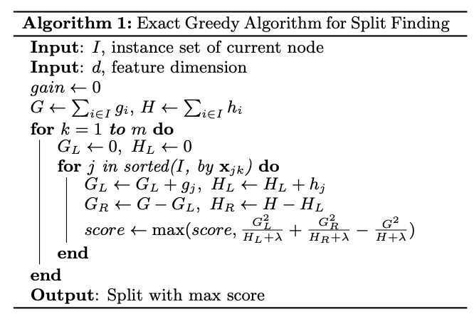

# XGBoost Algorithm Overview


아래 내용은 Decision Tree, Bagging, AdaBoost, GBDT\(Gradient Boosting Decision Tree\)에 대해 알고 있다는 것을 전제로 한다. 수식들로 인해 아래 과정들이 복잡해 보일 수 있지만, 펜을 잡고 논문과 공식 사이트의 설명을 같이 참조하면 쉽게 이해 가능하다.


## 1. XGBoost\(Extreme Gradient Boosting\) 특장점

* LightGBM, CatBoost과 같이 캐글에서 각광받고 있는 gradient boosting 알고리즘
* Parallel Processing: GBDT에 기반하고 있지만, GBDT과 달리 병렬 처리가 가능하여 수행 시간이 훨씬 빠름 \(LightGBM보다는 느림\)
* Robust to Overfitting: Greedy 알고리즘을 사용하여 가지치기\(pruning\)를 수행하고 early stopping 기능을 지원하기 때문에 과적합이 잘 일어나지 않음
* Cost Function: Cost Function에 대해 1차, 2차 도함수 정보를 모두 사용
* Regularization: Decision Tree 구성 시 Regularization Term을 추가하여 overfitting 방지
* Flexible Loss function: 사용자 정의 Loss function을 원하는 대로 정의할 수 있음
* Sparsity aware: Missing Value에 대해서 자체적으로 처리함

## 2. Boosting 원리: Objective Function

### Objective Function: Training Loss + Regularization

$$K$$개의 트리가 있고 모델 $$f_k$$를 더해 $$\hat{y}$$를 예측할 때, 이 트리들이 모여서 구성되는 모델 $$F$$\(CART; Classification And Regression Trees의 모든 tree 세트\)는 아래와 같이 표현할 수 있다.

$$
\hat{y}_i = \sum_{k=1}^K f_k(x_i), f_k \in F \tag {1}
$$

목적 함수\(objective function\)는 아래와 같이 정의하여 최적화할 수 있다.

$$
\text{obj} = \sum_{i=1}^n l(y_i, \hat{y}_i^{(t)}) + \sum_{i=1}^t\Omega(f_i) \tag{2}
$$

여기에서 좌측 항은 실제값과 예측값과의 차이를 나타내는 training loss이고, 우측 항은 트리 모델의 복잡도를 조절하여 과적합\(overfitting\)을 방지하는 정규화\(regularization\) 항이다. 학습할 파라메터들은 각 트리의 구조와 leaf 노드의 score로 $$\theta= { {f1, f_2, \cdots, f_{K}} }$$이다.

### Additive Training

XGBoost는 종래 GBM과 달리 트리 구조를 직접 학습한다. 다시 말해, 트리에 대한 최적 파라메터들을 찾는다.

종래 GBM에서는 Stochastic Gradient Descent를 사용하기에 잔차\(residual\)에 대한 순차적인 계산이 필요하기에 한 번에 모든 트리의 최적화가 불가능하다. 이를 해결하기 위해 XGBoost에서는 한 번에 하나의 트리를 추가하는 가산\(additive\) 전략을 사용한다.

$$
\begin{aligned}\hat{y}_i^{(0)} &= 0 \\ \hat{y}_i^{(1)} &= f_1(x_i) = \hat{y}_i^{(0)} + f_1(x_i) \\ \hat{y}_i^{(2)} &= f_1(x_i) + f_2(x_i)= \hat{y}_i^{(1)} + f_2(x_i )\\ &\dots \\ \hat{y}_i^{(t)} &= \sum_{k=1}^t f_k(x_i)= \hat{y}_i^{(t-1)} + f_t(x_i)\end{aligned} \tag{3}
$$

$$\hat{y}_i^{(t)}$$ 는 $$t$$ 시까지의 예측 결과이고 $$f_t(x_i)$$는 $$t$$ 시점의 분류기 함수이다.

\(3\)의 수식을 그대로 치환하면 목적함수는 아래와 같이 표현할 수 있다.

$$
\begin{aligned}\text{obj}^{(t)} & = \sum_{i=1}^n l(y_i, \hat{y}_i^{(t)}) + \sum_{i=1}^t\Omega(f_i) \\ & = \sum_{i=1}^n l(y_i, \hat{y}_i^{(t-1)} + f_t(x_i)) + \Omega(f_t) + \mathrm{constant}\end{aligned} \tag{5}
$$

만약, loss function을 MSE\(Mean Squared Error\)로 정의하면 목적 함수는 다음과 같다.

$$
\begin{aligned}\text{obj}^{(t)} & = \sum_{i=1}^n (y_i - (\hat{y}_i^{(t-1)} + f_t(x_i)))^2 + \sum_{i=1}^t\Omega(f_i) \\ & = \sum_{i=1}^n [2(\hat{y}_i^{(t-1)} - y_i)f_t(x_i) + f_t(x_i)^2] + \Omega(f_t) + \mathrm{constant}\end{aligned} \tag{6}
$$

\(6\)의 수식을 잘 살펴보자. 분명 $$t$$ 에 대한 문제인데 $$t-1$$ 시점까지 고려해야 하기에 loss function 최적화가 매우 복잡해진다. 이를 어떻게 해결할 수 있을까?

### Taylor 급수를 활용한 objective function 간소화

상기와 같이 목적 함수를 그대로 전개하면, 식도 복잡해지고 다양한 loss function을 적용하는데 어려움이 있다. 하지만, 테일러 급수를 사용해 간소화하면 이러한 어려움들을 해결할 수 있다.

테일러 급수 전개로 목적 함수를 치환하면 아래와 같다. $$g_i$$는 1차 편미분 함수로 gradient이고, $$h_i$$는 2차 편미분 함수로 Hessian 행렬이다.

$$
\text{obj}^{(t)} = \sum_{i=1}^n [l(y_i, \hat{y}_i^{(t-1)}) + g_i f_t(x_i) + \frac{1}{2} h_i f_t^2(x_i)] + \Omega(f_t) + \mathrm{constant} \tag {7} \\ \begin{aligned}g_i &= \partial_{\hat{y}_i^{(t-1)}} l(y_i, \hat{y}_i^{(t-1)})\\ h_i &= \partial_{\hat{y}_i^{(t-1)}}^2 l(y_i, \hat{y}_i^{(t-1)})\end{aligned}
$$

loss function $$l$$은 $$t$$시점에서 상수이므로, 상수를 constant 항에 포함시킬 수 있다. 따라서, \(7\) 을 아래와 같이 축약 가능하다.

$$
\text{obj}^{(t)} = \sum_{i=1}^n [ g_i f_t(x_i) + \frac{1}{2} h_i f_t^2(x_i)] + \Omega(f_t) + \mathrm{constant} \tag {8}
$$

이제 loss function 형태에 의존적이지 않으므로, $$g$$와 $$h$$를 사용자 정의하여 다양한 loss function을 사용할 수 있으며, 분산 처리가 용이하다.

이제 수식 우측의 $$\Omega(f_t)$$ 항에 대해 알아보자.

### Regularization

Decision Tree 달리 XGBoost에서는 트리의 비중을 조절하는 정규화 함수를 적극 사용한다.

우선, 트리 함수 $$f_t(x)$$ 를 아래와 같이 정의하자. \($$w$$: leaf 노드의 score, $$q$$: 데이터 포인트들을 $$q$$번째 leaf 노드에 할당하는 함수, $$T$$: leaf 노드의 개수\)

$$
f_t(x) = w_{q(x)}, w \in R^T, q:R^d\rightarrow \{1,2,\cdots,T\} \tag{9}
$$

다시 말해, 데이터 포인트 $$x$$를 $$q$$번째 leaf에 할당하고, 그에 대응하는 $$q(x)$$번째 leaf의 score $$w_{q(x)}$$를 데이터 포인트에 할당한다.

XGBoost에서는 트리의 비중\(weights\)을 조절하는 정규화 함수 $$\Omega(f_t)$$를 아래와 같이 정의한다.

$$
\Omega(f_t) = \gamma T + \frac{1}{2}\lambda \sum_{j=1}^T w_j^2 \tag{10}
$$

$$\gamma T$$는 leaf의 개수로 모델이 얼마나 정확하게 만들어졌는지에 대한 복잡도를 조정하고, $$\frac{1}{2}\lambda \sum_{j=1}^T w_j^2$$는 leaf score의 L2 norm 함수이다. 이 함수도 최적화가 가능하다.

이제 수식 \(8\)은 \(9\)와 \(10\)을 그대로 치환하여 아래와 같이 풀어쓸 수 있다.

$$
\begin{aligned}\text{obj}^{(t)} &\approx \sum_{i=1}^n [g_i w_{q(x_i)} + \frac{1}{2} h_i w_{q(x_i)}^2] + \gamma T + \frac{1}{2}\lambda \sum_{j=1}^T w_j^2\\ &= \sum^T_{j=1} [(\sum_{i\in I_j} g_i) w_j + \frac{1}{2} (\sum_{i\in I_j} h_i + \lambda) w_j^2 ] + \gamma T\end{aligned} \tag{11}
$$

두번째 줄의 $$I_j = {i|q(x_i)=j}$$는 j번째 leaf에 할당된 데이터 포인트의 인덱스 세트로, 동일 leaf에 속한 모든 데이터 포인트는 동일한 score를 가지므로 첫번째 줄의 수식을 변경한 것이다. 수식의 sigma 윗첨자를 잘 확인해 보면, 목적 함수는 weight에 대한 2차식의 $$T$$개의 합으로 전개가 가능하다는 것을 알 수 있다. 이제 $$g$$와 $$h$$에 대해 최솟점이 되는 파라메터를 구하는 목적 함수 최적화를 수행해 보자.

## 3. Boosting 원리: Optimization

#### Formulation

$$G_j = \sum{i\in Ij} g_i, \;\; H_j = \sum{i\in I_j} h_i$$로 정의하여 \(11\)의 수식을 단순화해보면, 2차식\(quadratic form\)의 형태를 확인할 수 있다.

$$
\text{obj}^{(t)} = \sum^T_{j=1} [G_jw_j + \frac{1}{2} (H_j+\lambda) w_j^2] +\gamma T \tag{12}
$$

다시 말해, $$g$$와 $$h$$에 대해 최솟점을 만족하는 트리 $$j$$는 아래와 같이 표현할 수 있다.

$$
argmin_j{[G_j + \frac{1}{2}(H+\lambda)j^2]= -\dfrac{G}{H}, \;H > 0} \\ min_j{[G_j + \frac{1}{2}(H+\lambda)j^2]= -\dfrac{1}{2}\dfrac{G^2}{H}}\tag{13}
$$

loss function을 최소화하기 위해 $$w_j$$에 대한 loss function의 도함수를 0으로 설정하, 2차식에 대한 최적화 문제는 아래 형태로 최적화가 가능하다.

$$
\begin{aligned}w_j^\ast &= -\frac{G_j}{H_j+\lambda}\\ \text{obj}^\ast &= -\frac{1}{2} \sum_{j=1}^T \frac{G_j^2}{H_j+\lambda} + \gamma T\end{aligned} \tag{14}
$$

하지만, 한 가지 절차가 더 남아있다. 아래에서 확인해 보자.

#### Tree 분기

Decision Tree 기반 알고리즘은 과적합을 방지하기 위해 가지치기\(pruning\)가 필수이다. 이를 위해서는 이상적으로는 모든 트리를 생성하고, 이 중 가장 최적의 트리를 선택해야 하지만, 실제로 그렇게 적용하는 것은 NP-hard 문제로 매우 어렵기 때문에 XGBoost는 Level-wise tree growth 전략으로 한 번에 한 단계의 트리를 최적화한다. \(참고로, LightGBM은 leaf-wise tree growth 전략으로 더 복잡한 트리를 생성하지만, GOSS \(Gradient-based One-Side Sampling\) 와 EFB \(Exclusive Feature Bundling\) 등의 차별화된 최적화 방법으로 XGBoost보다 빠른 학습 속도를 자랑한다.\)

좀 더 구체적으로 설명하면, 트리를 greedy하게 키우면서 트리의 가지를 나누는 시점에서 왼쪽 가지와 오른쪽 가지에 대한 score를 계산하여 Information Gain을 계산하고 Gain이 음수일 때에는 가지치기를 수행한다. 특정 depth에서 가지치기 수행 시의 Information Gain은 아래와 같이 표현 가능하다.

$$
Gain = \frac{1}{2} \left[\frac{G_L^2}{H_L+\lambda}+\frac{G_R^2}{H_R+\lambda}-\frac{(G_L+G_R)^2}{H_L+H_R+\lambda}\right] - \gamma \tag{15}
$$

대괄호 안의 첫번째 항은 좌측 leaf score\(i.e., left side children score\), 두번째 항은 우측 leaf score, 마지막 항은 원래 leaf의 score를 산출하며, 마지막 gamma는 추가 leaf의 정규화 term이다. 가지 $$L$$과 $$R$$은 서로 중복이 발하지 않는 disjoint set이다. 만약 대괄호 안의 값이 $$\gamma$$보다 작다면, information gain이 음수가 되므로 더 이상 가지를 치지 않는 것이 좋다는 의미이다.

이에 대한 psuedo 코드는 아래와 같다.\(Exact Greedy Algorithm for Split Finding\) 다만, 실제 구현은 missing value까지 고려한 Sparsity-aware Split Finding을 사용한다.

마지막으로 Gain이 높은 $$T$$개의 트리들을 조합하여 부스팅을 수행하면 최적의 모델을 생성할 수 있다.

## References

* Paper
  * XGBoost: A Scalable Tree Boosting System: [https://arxiv.org/pdf/1603.02754.pdf](https://arxiv.org/pdf/1603.02754.pdf)
* Official website
  * [https://xgboost.readthedocs.io/en/latest/tutorials/model.html](https://xgboost.readthedocs.io/en/latest/tutorials/model.html)

