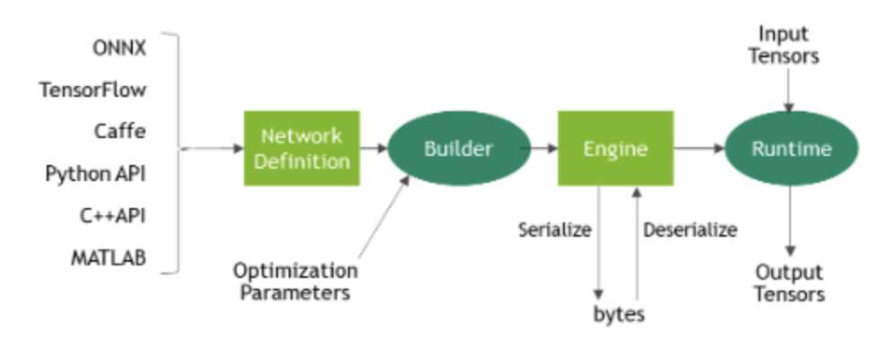
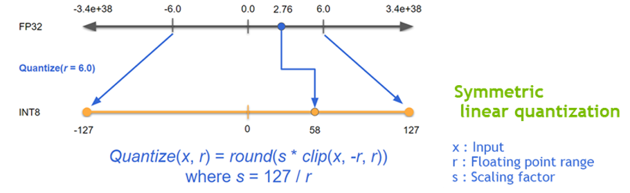
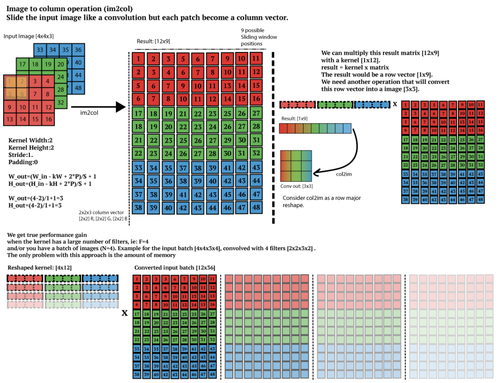

# TensorRT Overview

## Optional. TensorFlow Model

TensorFlow의 모든 파일 포맷은 Protocol Buffers에 기반하며, protobuf를 통해 직렬화된 형태로 저장됨

#### NodeDef

* 각 노드는 NodeDef 객체이며, TensorFlow 그래프의 기본적인 빌딩 블록
* 각각은 입력 커넥션과 함께 하나의 연산\(operation\)을 정의하며, 고유한 이름을 가지고 있음
  * op\(연산자 타입\):  `Add` , `MatMul`, `Conv2D` 등
  * `Const` 도 NodeDef에 값이 저장됨 \(정수, 실수, 문자열, Tensor\)
  * input: \["some\_node\_name", "another\_node\_name"\],  \["some\_node\_name", "another\_node\_name"\]

#### GraphDef

* NodeDef의 list이며, 연산 그래프를 정의함 \(`pbtxt` 포맷\)
* GraphDef 클래스는 [tensorflow/core/framework/graph.proto](https://github.com/tensorflow/tensorflow/blob/master/tensorflow/core/framework/graph.proto)에 정의된 프로토콜 버퍼 라이브러리에 의해 생성되는 객체
* GraphDef + CheckPoint를 같이 로드해야 사용 가능
  * 예: `model-ckpt-1000.data-00000-of-00001, model.pbtxt`
* 이를 완화하고자 모델 배포 시에는 `freeze_graph.py`로 frozen model\(`pb` 파일\)로 변환을 권장

#### CheckPoint

* Variable에 담긴 값은 NodeDef 가 아닌 CheckPoint 에 저장됨 \(`ckpt` 포맷\)
* `Saver`에 의해 생성됨
* Chepoint는 모델에 의해 정의된 연산에 대한 설명을 포함하지 않으므로 일반적으로 저장된 매개변수 값을 사용할 소스 코드를 사용할 수 있을 때만 유용
  * `model.ckpt.data-00000-of-00001` **:** 모델의 구조를 제외한 모든 변수들을 포함하지만, 모델 복원시 메타 파일과 데이터 파일이 필요
  * `model.ckpt.index` **:** 데이터 파일과 메타 파일을 올바르게 매핑하기 위한 인덱스 파일
  * `model.ckpt.meta`**:** 메타 그래프를 포함, 변수 값을 제외한 그래프의 구조

#### SavedModel

* Checkpoint보다 더 포괄적인 의미로 Graph\(실제로는 MetaGraph\)도 포함 \(보통 `saved_model.pb`\)
* Serving, Training, Evaluation을 위한 별도의 그래프가 포함되어 있음
* 따라서, 실제 TensorFlow Serving은 훈련된 모델을 SavedModel로 export하여 배포함

```python
$ docker pull tensorflow/serving

$ docker run -t --rm -p 8501:8501 \
    -v "/home/tf_serving/saved_model:/models/mnist_model" \
    -e MODEL_NAME=mnist_model \
    tensorflow/serving &
```

* 재훈련 가능하며, 비직렬화
* frozen graph와 동일한 pb 파일이지만, frozen graph와 다르므로 주의 필요

#### Frozen Graph

* Weight 내 Variable 노드를 Const 노드로 변환
* 모든 weight이 Checkpoint가 아닌 NodeDef에 저장되므로, GraphDef로 직렬화 가능
* 모델 배포 시에 pb 파일만 가지고 있으면 되며, default graph 객체나 `tf.Graph()`로 graph 객체를 만들어서 graph에 올림
* 다만, pb 파일 변환 시 자동 변환이 아닌 output node명을 알아야 변환이 되기 때문에 불편함
* SavedModel ↔Frozen Graph 상호 변환 가능. 모바일 디바이스 배포 시에는 Froezn Graph를 주로 쓰고 있음
* TensorRT 사용 시에는 pb 파일을 UFF, ONNX로 변환해야 함

#### ONNX\(Open Neural Network Echange\)

* 특정 딥러닝 프레임워크 환경에서 훈련된 모델을 다른 프레임워크에 호환하여 사용할 수 있는 공유 플랫폼으로 Facebook과 MS가 공동 개발
* 각 프레임워크별로 최적화하는 것보다 ONNX 기반으로 최적화하는 것이 효율적임
* 동적 계산 그래프를 이용하는 프레임워크\(예: PyTorch\)에서는 네트워크 계산을 한 번 수행해야 함
* [https://tutorials.pytorch.kr/advanced/super\_resolution\_with\_onnxruntime.html](https://tutorials.pytorch.kr/advanced/super_resolution_with_onnxruntime.html)
* [https://docs.aws.amazon.com/ko\_kr/dlami/latest/devguide/tutorial-onnx-pytorch-mxnet.html](https://docs.aws.amazon.com/ko_kr/dlami/latest/devguide/tutorial-onnx-pytorch-mxnet.html)

## 1. Introduction

### TensorRT란?

* SDK for high performance Deep Learning Inference
* Inference accelerator로 Framework 모델의 최적화\(Compression\) + Runtime Engine
  * NVIDIA GPU 연산에 적합한 최적화 기법들을 이용하여 모델을 최적화하는 Optimizer 와 다양한 GPU에서 모델 연산을 수행하는 Runtime Engine 을 포함
  * Optimizer 실행 전, 딥러닝 네트워크를 parser로 파싱해야 함 \(Caffe, UFF, ONNX\)
  * UFF는 TensorRT 7.0부터 deprecated이고 caffe parser는 많이 쓰이지 않으니, ONNX 위주로 보는 것을 권장


### Parsers

#### **Caffe Parser**

This parser can be used to parse a Caffe network created in BVLC Caffe or NVCaffe 0.16. It also provides the ability to register a plugin factory for custom layers. For more details on the C++ Caffe Parser, see [NvCaffeParser](https://docs.nvidia.com/deeplearning/sdk/tensorrt-api/c_api/classnvcaffeparser1_1_1_i_caffe_parser.html) or the Python [Caffe Parser](https://docs.nvidia.com/deeplearning/sdk/tensorrt-api/python_api/parsers/Caffe/pyCaffe.html).

#### **UFF Parser**

This parser can be used to parse a network in UFF format. It also provides the ability to register a plugin factory and pass field attributes for custom layers. For more details on the C++ UFF Parser, see [NvUffParser](https://docs.nvidia.com/deeplearning/sdk/tensorrt-api/c_api/classnvuffparser_1_1_i_uff_parser.html) or the Python [UFF Parser](https://docs.nvidia.com/deeplearning/sdk/tensorrt-api/python_api/parsers/Uff/pyUff.html).

* UFF\(Universal Framework Format\)
  * uff 컨버터를 사용하여 TensorFlow 그래프를 UFF로 변환
  * 만약 TensorRT에서 지원하지 않는 Layer가 존재 시, Custom Layer로 구현해야 함
* Convert TensorFlow's Session GraphDef directly on the fly to UFF format model; `convert_uff_from_tensorflow()`
* Convert the frozen model file to UFF format model; `convert_uff_from_frozen_model()`

#### **ONNX Parser**

This parser can be used to parse an ONNX model. For more details on the C++ ONNX Parser, see [NvONNXParser](https://docs.nvidia.com/deeplearning/sdk/tensorrt-api/c_api/classnvonnxparser_1_1_i_o_n_n_x_parser.html) or the Python [ONNX Parser](https://docs.nvidia.com/deeplearning/sdk/tensorrt-api/python_api/parsers/Onnx/pyOnnx.html).**Note:** Additionally, some TensorRT Caffe and ONNX parsers and plugins can be found on [GitHub](https://github.com/nvidia/TensorRT).

## 2. 핵심 요소

### Workflow

기 학습한 모델로부터 Network, Builder, Parser를 생성



#### Network Definition

* Tensor 연산은 무조건 layer를 거침 \(reshape, transpose, concat 등\)

#### Builder

* Network을 돌릴 환경을 세팅

#### Engine

* 애플리케이션이 추론을 실행할 수 있도록 함. 엔진 입력 및 출력에 대한 바인딩의 동기 및 비동기 실행, 프로파일 링 및 열거 및 쿼리 지원

### Quantization

* FP32의 데이터를 FP16이나 -127~127 범위의 INT8으로 양자화
* 원 데이터 x에\(clipping 수행\) scaling factor를 곱하면 간단하게 변환 가능
  * scaling factor  $s = 127/r$, $r$은 float point range로 절대값이 $r$보다 큰 값들은 모두 clipping
* 단, **INT8로 정밀도를 낮추면 모델 정확도에 영향을 주기 때문에, 추가 캘리브레이션 필요**
* EntropyCalibrator, EntropyCalibrator2, MinMaxCalibrator 지원



#### Other thoughts

* 상기 내용에서 언급하지 않지만, 0이 많다면 모델 정확도가 대폭 떨어질 위험성이 있음 \(특히 ReLU activation의 경우 음수는 모두 0이므로\)
* 이를 해결하기 위해, 음수~0, 0~양수로 구간을 분할하는 방법을 생각해볼 수 있음

### Precision Calibration

* 왼쪽 그림처럼 양자화를 수행하면 accuracy loss가 심하기 때문에 일정 threshold 내의 값만 양자화를 수행하는 것이 유리


* 최적의 threshold를 찾기 위한 방법: KL Divergence로 FP32의 데이터 분포와 INT8의 데이터 분포를 비교하여 objective를 minimize loss of information으로 지정하여 Calibration Dataset으로 훈련 수행
* EntropyCalibrator Algorithm
  * Calibration Dataset에 대해 FP32로 추론 수행; `ref_distr`
  * 각 레이어마다 다음의 로직을 수행
    * activation 히스토그램 수집
    * 각각 다른 threshold로 양자화된 분포 생성; `quant_distr`
    * `KL_divergence (ref_distr, quant_distr)`가 최소가 되는 threshold 선택
  * 상기 과정은 일반적인 데스크탑 워크스테이션에서 약 몇 분 소요됨
* Psuedo code \([https://on-demand.gputechconf.com/gtc/2017/presentation/s7310-8-bit-inference-with-tensorrt.pdf](https://on-demand.gputechconf.com/gtc/2017/presentation/s7310-8-bit-inference-with-tensorrt.pdf)\)

```c
Input: FP32 histogram H with 2048 bins: bin[ 0 ], …, bin[ 2047 ]

For i in range( 128 , 2048 ):
  // take first ‘i‘ bins from H
    reference_distribution_P = [ bin[ 0 ] , ..., bin[ i-1 ] ] 
    outliers_count = sum( bin[ i ] , bin[ i+1 ] , … , bin[ 2047 ] )
    reference_distribution_P[ i-1 ] += outliers_count
    P /= sum(P) // normalize distribution P
    candidate_distribution_Q = quantize [ bin[ 0 ], …, bin[ i-1 ] ] into 128 levels 
    expand candidate_distribution_Q to ‘ i ’ bins // explained later
    Q /= sum(Q) // normalize distribution Q
    divergence[ i ] = KL_divergence( reference_distribution_P, candidate_distribution_Q)
End For

Find index ‘m’ for which divergence[ m ] is minimal

threshold = ( m + 0.5 ) * ( width of a bin )
```

### Winograd Convolution

#### im2col \(as-is\)

* Convolution 연산을 그대로 수행하면 시간 복잡도가 매우 높으므로, 1차원 형태로 바꾸어서 빠르게 convolution 연산을 수행하기 위한 방법
* 단점: 연산 메모리 증가



#### Winograd Convolution \(to-be\)

* 3×3 행렬 계산의 연산 횟수 대폭 저감 \(2.25배 성능 향상\)
* 곱셈 연산을 곱셈 + 덧셈으로 바꿈
* size 4의 이미지 f와 size 3의 필터 g가 있다고 가정하자.
* $$  f=\begin{bmatrix}     1 & 2 & 3 & 4    \end{bmatrix},   g=\begin{bmatrix}     -1 & -2  & -3   \end{bmatrix}$$ 

  ```text
  $f=\begin{bmatrix}
    1 & 2 & 3 & 4
  \end{bmatrix}$,    $g=\begin{bmatrix}
    -1 & -2 & -3
  \end{bmatrix}$
  ```

  im2col을 이용하면 dot-product로 계산할 수 있다.

  $$\begin{bmatrix}    1 & 2 & 3 \\    2 & 3 & 4  \end{bmatrix}   \begin{bmatrix}    -1 \\ -2 \\ -3  \end{bmatrix} =   \begin{bmatrix}    m_1+m_2+m_3 \\ m_2-m_3-m_4  \end{bmatrix}$$ 

  왼쪽 숫자들을 일반화하면, 아래와 같이 변환할 수 있고

  $$\begin{bmatrix}    d_0 & d_1 & d_2 \\    d_1 & d_2 & d_3  \end{bmatrix}   \begin{bmatrix}    g_0 \\ g_1 \\ g_2  \end{bmatrix} =   \begin{bmatrix}    m_1+m_2+m_3 \\ m_2-m_3-m_4  \end{bmatrix}$$ 

  이를 $$m_1, m_2, m_3, m_4$$에 대해 치환할 수 있다..

  $$m_1 = (d_0 - d_2)g_0 \\ m_2 = (d_1 + d_2)\dfrac{g_0+g_1+g_2}{2} \\ m_3 = (d_2 - d_1)\dfrac{g_0-g_1+g_2}{2} \\ m_4 = (d_2 - d_3)g_2$$

* 이 4개의 값으로 dot-product 연산을 대체할 수 있고 $$\dfrac{g_0+g_1+g_2}{2}, \dfrac{g_0-g_1+g_2}{2}$$ 은 각 convolution operation마다 재계산할 필요가 없으므로 계산 복잡도가 감소한다.
* `os.environ['TF_ENABLE_WINOGRAD_NONFUSED'] = '1'`로 설정 가능

### Graph Optimization

* Layer Fusion과 Tensor Fusion으로 모델 layer 수와 파라메터 수 저감
  * 예: ResNet-152의 경우 총 layer 670 → 159 layer로 저감
  * Convolution, Bias and ReLU Layer를 CBR Layer로 단일화하고, 다시 이를 통합
* Layer Fusion
  * Vertical Layer Fusion
  * Horizontal Layer Fusion
* Tensor Fusion


### Kernel Auto-tuning

* GPU마다 CUDA engine의 갯수, architecture, memory 그리고 specialized engine 포함 여부에 따라 optimize된 kernel 이 다름
* 이를  kernel auto-tuning을 통해 GPU에 따른 최적의 layer 및 알고리즘을 선택해 줌
* TensorRT Runtime engine build 시에 선택적으로 수행 가능

### Dynamic Tensor Memory & Multi-stream execution

* Dynamic tensor memory: Memory management를 통하여 footprint를 줄여 재사용 가능 → 메모리 사용량 감소
* Multi-stream execution: CUDA stream 기술을 이용하여 다중 입력 스트림의 스케줄링을 통해 병렬 효율 극대화

## 3. Getting Started

직접 패키지를 다운로드받아 설치하는 방법도 있지만, 비교적 간단한 도커 컨테이너로 설치하는 방법이 가장 무난함; [https://docs.nvidia.com/deeplearning/tensorrt/container-release-notes/running.html](https://docs.nvidia.com/deeplearning/tensorrt/container-release-notes/running.html)

만약 컨테이너 없이 로컬 환경에서 설치하려면 [https://eehoeskrap.tistory.com/302](https://eehoeskrap.tistory.com/302) 참조

### 컨테이너 이미지 다운로드

```c
$ docker pull nvcr.io/nvidia/tensorrt:20.06-py3
```

### 이미지 실행

```c
// docker 19.03 이상
$ docker run --gpus all -it --rm -v local_dir:container_dir [nvcr.io/nvidia/tensorrt:](http://nvcr.io/nvidia/tensorrt:)<xx.xx>-py<x> 

// docker 19.03 미만, SageMaker는 18대 버전이므로 nvidia-docker로 실행해야 함)
$ nvidia-docker run -it --rm -v local_dir:container_dir [nvcr.io/nvidia/tensorrt:](http://nvcr.io/nvidia/tensorrt:)<xx.xx>-py<x> 

// SageMaker 실행 예시
$ nvidia-docker run -it --rm -v /home/ec2-user/SageMaker/tensorrt:/host_temp [nvcr.io/nvidia/tensorrt:20.06-py3](http://nvcr.io/nvidia/tensorrt:20.06-py3)
```

### 샘플 코드 컴파일

```c
$ cd /workspace/tensorrt/samples 
$ make -j4
```

### 샘플 코드 실행

```c
$ cd /workspace/tensorrt/bin
$ ./sample_movielens_mps //예시
```


### 딥러닝 프레임워크 설정

* TensorFlow 및 PyTorch 딥러닝 프레임워크는 TensorRT 컨테이너에 포함되어 있지 않으므로, 해당 프레임워크를 사용하는 샘플 실행 시에는 아래 셀스크립트 수행 필요

```c
$ /opt/tensorrt/python/python_setup.sh
```

### Python 코드 실행

```c
$ cd /workspace/tensorrt/samples/python/introductory_parser_samples
$ python uff_resnet50.py -d /workspace/tensorrt/python/data 
$ python onnx_resnet50.py -d /workspace/tensorrt/python/data
```


## 4. TF-TRT \(Optional\)

TensorFlow에 내장되어 있는 TensorRT, 즉 TF-TRT로 TensorRT와 다름

* [https://developer.nvidia.com/blog/tensorrt-integration-speeds-tensorflow-inference/](https://developer.nvidia.com/blog/tensorrt-integration-speeds-tensorflow-inference/) 에 따르면 TensorRT가 TF-TRT보다 약 2배 가까이 빠르다고 하지만 outdate된 자료라 확인 필요
* pre-compiled 패키지는 TF-TRT가 디폴트로 사용 불가능하므로 TensorRT 옵션을 활성화하여 밑바닥부터 컴파일해야 함
  * [https://www.tensorflow.org/install/source](https://www.tensorflow.org/install/source)

### Code Snippet

#### TensorFlow 1.x \(SavedModel Format\)

* 주의: `trt.create_inference_graph()`는 더 이상 지원하지 않음

```python
from tensorflow.python.compiler.tensorrt import trt_convert as trt
converter = trt.TrtGraphConverter(input_saved_model_dir=input_saved_model_dir)
converter.convert()
converter.save(output_saved_model_dir)
```

#### TensorFlow 1.x \(Frozen Graph\)

```python
from tensorflow.python.compiler.tensorrt import trt_convert as trt
converter = trt.TrtGraphConverter(
    input_graph_def=frozen_graph,
    nodes_blacklist=['logits', 'classes'])
frozen_graph = converter.convert()
```

#### TensorFlow 2

* Frozen Graph 변환은 TensorFlow 2에서 지원하지 않음 \(주의: Direct TensorRT는 여전히 Frozen Graph 지원함\)

```python
from tensorflow.python.compiler.tensorrt import trt_convert as trt
converter = trt.TrtGraphConverterV2(input_saved_model_dir=input_saved_model_dir)
converter.convert()
converter.save(output_saved_model_dir)
```

## 5. 실제 적용 예시

#### TensorFlow → ONNX → TensorRT

* [https://developer.nvidia.com/blog/speeding-up-deep-learning-inference-using-tensorflow-onnx-and-tensorrt/](https://developer.nvidia.com/blog/speeding-up-deep-learning-inference-using-tensorflow-onnx-and-tensorrt/) 참조
* Convert the TensorFlow/Keras model to a .pb file.
* Convert the .pb file to the ONNX format.
* Create a TensorRT engine.
* Run inference from the TensorRT engine.

#### PyTorch → ONNX → TensorRT

* [https://www.learnopencv.com/how-to-convert-a-model-from-pytorch-to-tensorrt-and-speed-up-inference/](https://www.learnopencv.com/how-to-convert-a-model-from-pytorch-to-tensorrt-and-speed-up-inference/) 참조
* Train a model using PyTorch
* Convert the model to ONNX format
* Use NVIDIA TensorRT for inferencee
* Builder 인스턴스 생성 → Builder는 Network과 TensorRT Engine 생성
* Parser 인스턴스 생성 후 ONNX 파일 파싱

```python
import pycuda.driver as cuda
import pycuda.autoinit
import numpy as np
import tensorrt as trt

# logger to capture errors, warnings, and other information during the build and inference phases
TRT_LOGGER = trt.Logger()

def build_engine(onnx_file_path):
    # initialize TensorRT engine and parse ONNX model
    builder = trt.Builder(TRT_LOGGER)
    network = builder.create_network()
    parser = trt.OnnxParser(network, TRT_LOGGER)

    # parse ONNX
    with open(onnx_file_path, 'rb') as model:
        print('Beginning ONNX file parsing')
        parser.parse(model.read())
    print('Completed parsing of ONNX file')
```

* 엔진 파라메터 설정

#### PyTorch → TensorRT

* torch2trt: [https://github.com/NVIDIA-AI-IOT/torch2trt](https://github.com/NVIDIA-AI-IOT/torch2trt)

#### Object Detection on GPUs in 10 Minutes

* [https://developer.nvidia.com/blog/object-detection-gpus-10-minutes/](https://developer.nvidia.com/blog/object-detection-gpus-10-minutes/)

#### SageMaker Neo and DLR

* 개발자 가이드의 내용과 다르니 주의 필요; [https://neo-ai-dlr.readthedocs.io/en/latest/tensorrt.html](https://neo-ai-dlr.readthedocs.io/en/latest/tensorrt.html) 참조
* Target 디바이스, GPU, 모델 종류에 따라 최적의 컴파일러를 선택함
  * TensorRT로 먼저 컴파일하고, 그 다음 순위로 TVM로 컴파일함
  * TensorRT 라면 \`Building new TensorRT engine for subgraph tensorrt\_0, 

    Finished building TensorRT engine for subgraph tensorrt\_0\` 같은 메세지가 출력되어야 함
* Caching TensorRT Engine
  * 첫 추론 실행 시, DLR은 TensorRT API를 호출하여 엔진을 빌드함.  빌드 시 `TVM_TENSORRT_CACHE_DIR` 환경 변수를 설정하여 빌드된 Engine을 디스크에 저장할 수 있음.
  * [https://neo-ai-dlr.readthedocs.io/en/latest/tensorrt.html\#caching-tensorrt-engines](https://neo-ai-dlr.readthedocs.io/en/latest/tensorrt.html#caching-tensorrt-engines)

## References

* NVIDIA TensorRT Documentation: [https://docs.nvidia.com/deeplearning/tensorrt/](https://docs.nvidia.com/deeplearning/tensorrt/)
* \[TensorRT\] NVIDIA TensorRT 개념, 설치방법, 사용하기: [https://eehoeskrap.tistory.com/414](https://eehoeskrap.tistory.com/414)
* Understanding ‘Winograd Fast Convolution’: [https://blog.usejournal.com/understanding-winograd-fast-convolution-a75458744ff](https://blog.usejournal.com/understanding-winograd-fast-convolution-a75458744ff)
* Speeding up Deep Learning Inference Using TensorFlow, ONNX, and TensorRT: [https://developer.nvidia.com/blog/speeding-up-deep-learning-inference-using-tensorflow-onnx-and-tensorrt](https://developer.nvidia.com/blog/speeding-up-deep-learning-inference-using-tensorflow-onnx-and-tensorrt/?fbclid=IwAR19NFd-Nv4UN5OqRiQa2-_8PprRu5_CUahnunQLgO2A2Ih0PHgt_KF3mzo)
* How to Convert a Model from PyTorch to TensorRT and Speed Up Inference: [https://www.learnopencv.com/how-to-convert-a-model-from-pytorch-to-tensorrt-and-speed-up-inferenc](https://www.learnopencv.com/how-to-convert-a-model-from-pytorch-to-tensorrt-and-speed-up-inference/?fbclid=IwAR2Mf4kGtv7geFZxA0IHqjaoyLTNaFlK9hGgtDiMXiPNr1yywpHhaRceGyA)e
* [https://arxiv.org/abs/1509.09308](https://arxiv.org/abs/1509.09308)

