# BERT\(Bi-directional Encoder Representations from Transformers\)

## 1. Background

* 과거에는 단어가 one-hot encoding이나 Word2Vec/Fasttext와 같은 고정 길이 피쳐 임베딩으로 표현 → 표현력 제한
  * 예: “The man was accused of robbing a bank.”,  “The man went fishing by the bank of the river.”에서 bank의 뜻이 다름에도 불구하고 bank에 대한 임베딩이 동일
* Transformer: 이전 단어들을 보고 다음 단어를 예측하는 단방향\(uni-directional\) 모델
* Bi-LSTM: Shallow 양항향\(\(Bi-directional\) 모델이므로 language representation 부족
* BERT: Deep 양방향\(Bi-directional\) 모델로 새로운 방식으로 학습 \(i.e. AutoEncoding Language Model\)
  * 문장에 15%의 확률로 masking 처리 후 주변 단어들을 보고 mask된 단어를 예측하는 양방향\(bi-directional\) 모델 → `Masked Language Model(MLM)`
  * 문장들 사이의 관계를 학습하기 위해 다음 문장 여부를 나타내는 IsNext/NotNext 레이블 추가 → `Next Sentence Prediction(NSP)`
* OpenAI GPT도 Transformer 구조를 사용하지만, 앞 단어를 보고 뒷 단어를 예측하는 Transformer Decoder를 사용. 반면 BERT는 전체 데이터를 한 번에 Transformer Encoder에 넣음.
* Seq2seq, Transformer, OpenAI GPT-2의 **자동 회귀\(AR; Auto-Regressive\) 모델이 아닌 오토인코더\(Auto-Encoding\) 모델**
* 11 개의 NLP tasks에서 SOTA\(state-of-the-art\) 달성

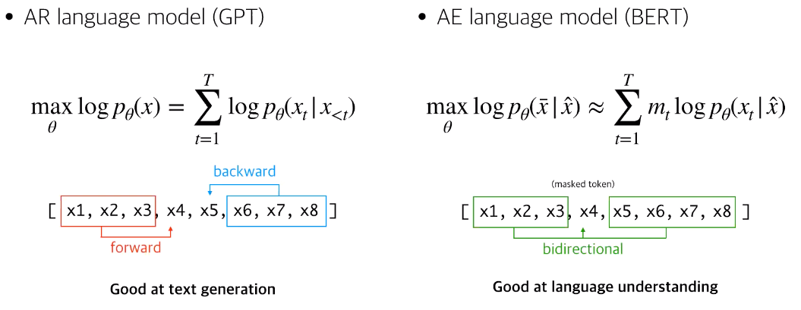

## 2. Wordpiece Tokenizing

### Wordpiece Model

* 어휘\(vocabulary\) 개수가 많을 수록 계산 비용 증가. 어휘 개수가 제한되면 미등록 단어들이 많기에 language representation 저하
* 이를 해결하기 위한 방법이 Wordpiece이며, 단어를 표현할 수 있는 subwords units으로 모든 단어를 표현
* Wordpiece 모델은 토크나이저+임베딩까지 수행 \(학습 필요\)
* 구글에서 sentencepiece 패키지 공개; `pip install sentencepiece`로 설치 가능

### Byte-pair Encoding\(BPE\)

* BERT, GPT-2에서 쓰이는 토크나이저로 별도의 학습 없이 빈도수에 기반해 단어를 의미 있는 패턴\(subword\)으로 잘라서 토크나이징
* 두 번째 이후 나오는 서브워드들에 모두 `##`을 붙임 \(여러 가지 의미가 나올 수 있기 때문에\)
* 가장 높은 빈도수를 가진 bi-gram best pair 획득하여 병합\(merge\)

### Example


### **Iter 0**

* 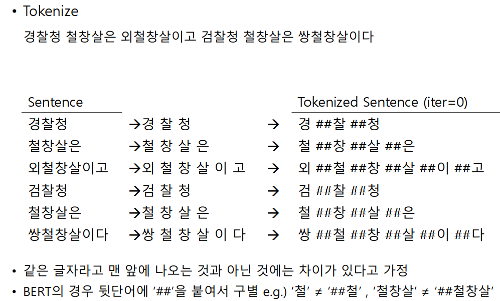 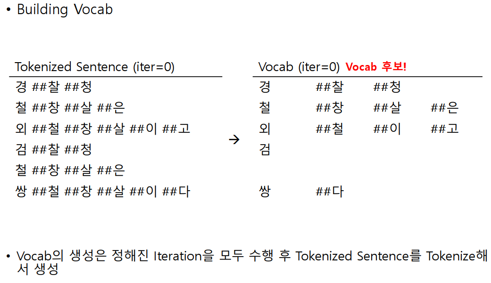 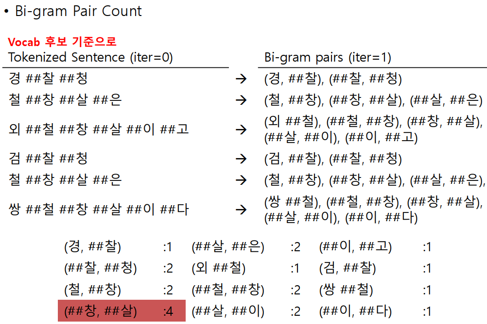 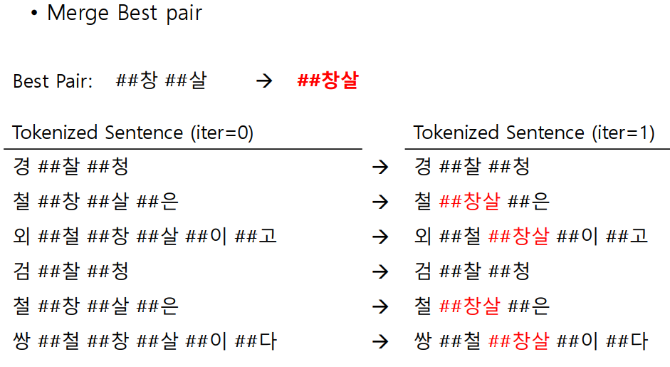 

### **Iter 1**

* 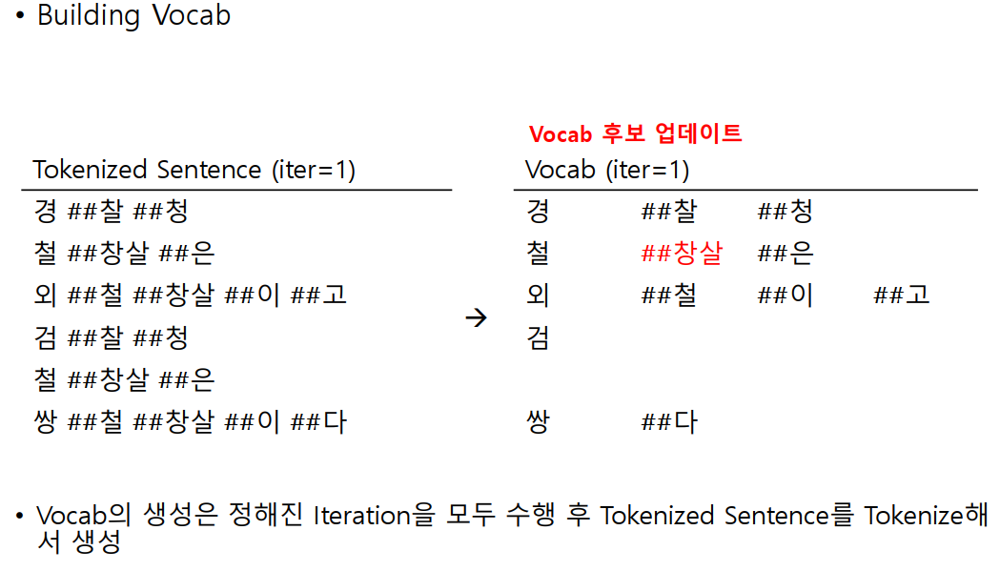  

### Iter 2

* 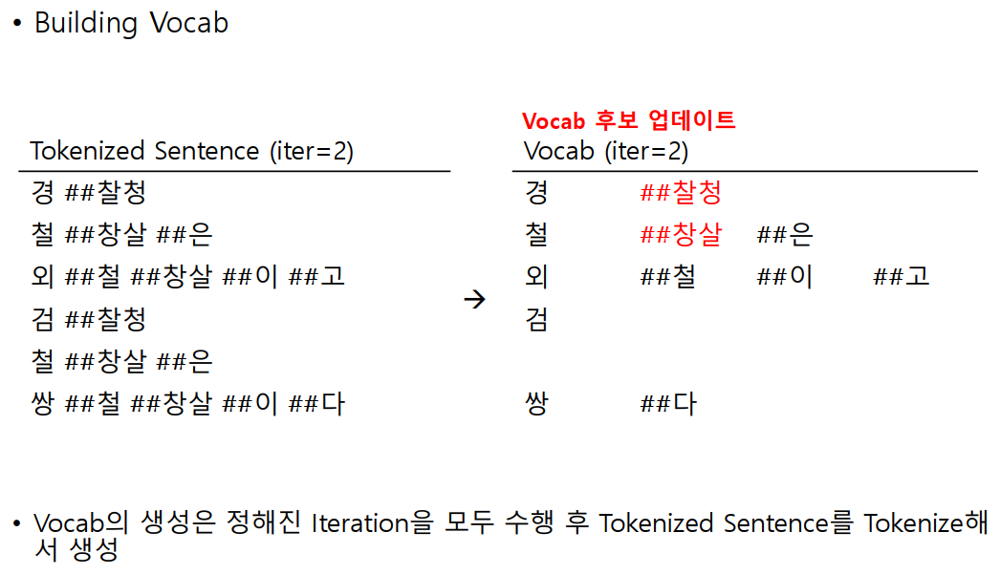 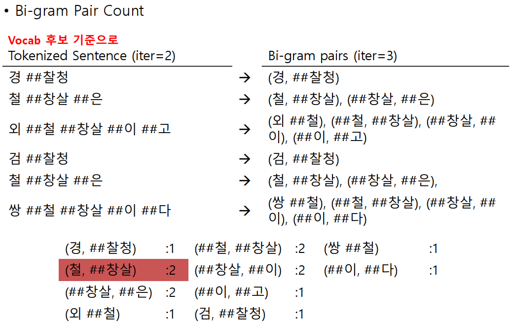 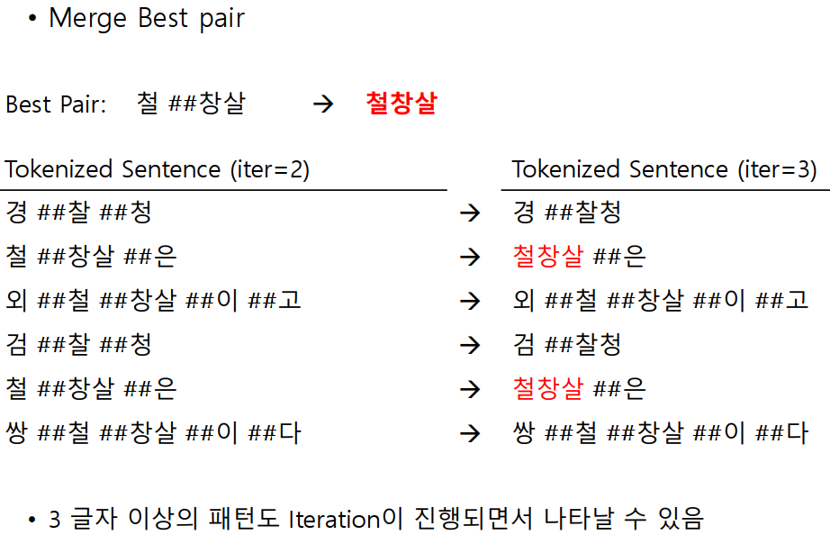 

## 3. Training Task

Pre-training 시에는 Masked Language Model\(MLM\)의 loss와 Next Sentence Prediction\(NSP\)의 loss를 합산하여 total loss 계산

### Pre-training; Masked Language Model\(MLM\)

* 양방향 맥락을 고려하며 입력 문장 내 마스크된 단어들을 원래의 단어로 예측하도록 학습; **Denosing 오토인코더의 경우 전체 입력 데이터를 예측하지만, BERT는 마스크된 단어만 예측한다는 것이 차이점**. Word2Vec의 CBOW 모델과 유사하지만 Context 토큰을 Center 토큰이 되도록 학습하고 Weights를 벡터로 갖는 CBOW와 달리, 마스킹된 토큰을 맞추도록 학습한 결과를 직접 벡터로 갖기 때문에 보다 직관적임.
* Wordpiece 토크나이징 처리 완료된 토큰들 중 15%의 토큰을 랜덤하게 선택
* 80%를 마스크\(`[MASK]`\) 토큰으로 바꾸고 10%는 랜덤하게 다른 단어로 대체하고 10%는 그대로 둠.  마스크 토큰은 파인튜닝 시에는 사용하지 않음.
  * Transformer Encoder는 어떤 단어가 마스킹되었는지, 어떤 단어가 random words로 바뀌었는지 모르기 때문에, 모든 토큰에 대해 분산 contextual representation을 유지하도록 함. 즉, 문장 내 모든 단어 사이의 의미적, 문법적 관계를 좀 더 자세히 볼 수 있음.
  * **Random word로 바뀌는 건 15%의 10%로 1.5%밖에 되지 않으므로, language understanding 능력에 영향을 주지 않음.**
  * 단, 매 배치에서 15%의 단어만 예측하기 때문에 pre-training step이 훨씬 많이 필요함 → 학습 시간 증가

### Pre-training; Next Sentence Prediction\(NSP\)

* NLI\(Natural Language Inference\), QA\(Question Answering\)의 파인튜닝을 위해 마스크된 단어를 맞추는 태스크 \(MLM만으로는 충분하지 않음\)


* 두 문장을 사전 학습시에 같이 넣어줘서 두 문장이 연관된 문장인지, 연관되지 않은 문장인지 맞추게 함 \(IsNext, NotNext 여부 학습\)
* 두번째 문장은 corpus의 다음 문장을 50% 확률로 랜덤하게 가져옴
* 예시

  > Input = `[CLS] the man went to [MASK] store [SEP] he bought a gallon [MASK] milk [SEP]` Label = `IsNext` 
  >
  > Input = `[CLS] the man [MASK] to the store [SEP] penguin [MASK] are flight ##less birds [SEP]`Label= `NotNext`

* 학습 데이터의 10%는 사용자가 정한 최대 시퀀스 길이보다 짧게 되도록 함

### Training Time

* V100 8장으로 학습 시 약 42일 소요
* 16 TPU로 4일 소요 \($45 x 16 x 24 x 4 = 약 7700만원\)
* 구글에 다국어로 사전학습된 BERT base 모델 파일 model zoo에 공개 \(한국어 포함\)

### Fine-tuning

* 사전학습된 가중치들 로드
* Single TPU에서 1시간, GPU에서 몇 시간 안에 결과를 볼 수 있음
* Epoch를 많이 돌리지 않아도 되며 3~4 epoch 정도만 돌려도 만족할 만한 성능이 나옴 \(그런데 한국어나 일본어는 그렇지 않음...\)
* 큰 데이터셋\(100k+개의 라벨링된 학습 데이터\)에서는 하이퍼파라미터의 영향을 덜 받음

## 4. Model

### Model Architecture

* **BERT\_base** : L=12, H=768, A=12, Total Parameters = 110M
  * BERT-Base 모델의 경우 각각의 토큰 벡터 768차원을 헤드 수 만큼인 12등분 하여 64개씩 12조각으로 차례대로 분리
  * Base 모델은 GPT와 동일 하이퍼파라메터 사용
* **BERT\_large** : L=24, H=1024, A=16, Total Parameters = 340M
* L : transformer block의 layer 수, H : hidden size, A : self-attention heads 수, feed-forward/filter size = 4H

### Input representation


* 첫번째 token은 항상 **`[CLS]` \(**클래스 토큰\)이며 IsNext/NotNext 분류 문제를 해결할 때 사용
* **`[SEP]`**는 문장의 끝을 나타내는 식별자 토큰으로 두 문장을 구분하는 역할로도 쓰임. \(예: token A 다음에 **`[SEP]`**, token B 다음에 **`[SEP]`**\)
* _**Token embedding**_: 토큰의 의미 표현으로 워드 임베딩
* _**Segment embedding:**_ 문장-문장을 이어주는\(Token A, Token B 구분\) 용도로 토큰 타입 및 입력 문장의 종류에 따라 각각 다른 값을 부여
* _**Position Embedding**_: 토큰에 sequential한 의미를 부여하기 위한 목적으로 토큰 개수에 따라 학습. Encoding과 달리 Embedding은 학습을 통해 Position 정보를 고정값이 아닌 Parameter로서 가짐.

### GELU\(Gaussian Error Linear Units\)

* [https://arxiv.org/abs/1606.08415](https://arxiv.org/abs/1606.08415)
* ReLU + Dropout 결합; 입력에 0 또는 1을 확률적으로 곱하고\(stochastically multiply\) activation function 적용
* 음수에 대해서도 미분이 가능해 약간의 기울기 전달 가능
* 아래 수식의 간단한 증명은 [https://datascience.stackexchange.com/questions/49522/what-is-gelu-activation](https://datascience.stackexchange.com/questions/49522/what-is-gelu-activation) 에서 확인 가능


### BERT의 연산 비용이 왜 높을까?

* Word2Vec의 경우 softmax 연산을 줄이기 위해 negative sampling을 사용해 다중 분류 문제를 이진 분류 문제로 바꾸지만, BERT는 전체 vocab size에 대한 softmax를 모두 계산
* 영문 학습 모델의 vocab size: 30,522개, 한국어의 경우 형태소 분석 결과가 10만개를 넘어가므로 더욱 오래 걸림

### Comparison of BERT and OpenAI GPT

* GPT는 BooksCorpus\(800M 단어\)으로 학습시켰지만, BERT는 Wikipedia\(2,500M 단어\)도 추가해서 학습
* GPT는 `[SEP]`, `[CLS]` 토큰을 fine-tuning때만 사용했지만, BERT는 pre-training 단계부터 `[SEP]`, `[CLS]` 그리고 문장 임베딩\(A, B\)도 함께 학습
* GPT는 하나의 배치에 32,000 단어를 1M 스텝에 거쳐 학습, BERT는 128,000 단어를 1M 스텝에 거쳐 학습
* GPT는 모든 실험의 fine-tuning 단계에서 0.00005의 learning rate 사용, BERT는 문제별로 dev-set에 알맞는 learning rate 선택

## 5. Implementation

### Token A & Token B 결정

* 1 batch는 Token A, Token B로 이루어져 있어야 함
* max sequence length=16이라고 가정할 때, target sequence length = \(16-3\) = 13 \(`[CLS]` , `[SEP]`, `[SEP]` 토큰이 필요하므로\)

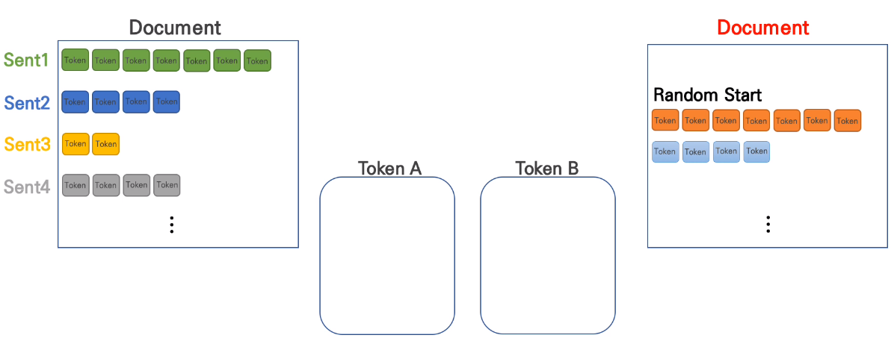

* 실제 문장 순서대로 정의 시 Token A와 Token B에 들어갈 문장은 random하게 선택 \(예; Sent1만 Token A에 들어갈 수 있거나, Sent1 & Sent2가 Token A, Sent3이 Token B에 들어갈 수 있음\)

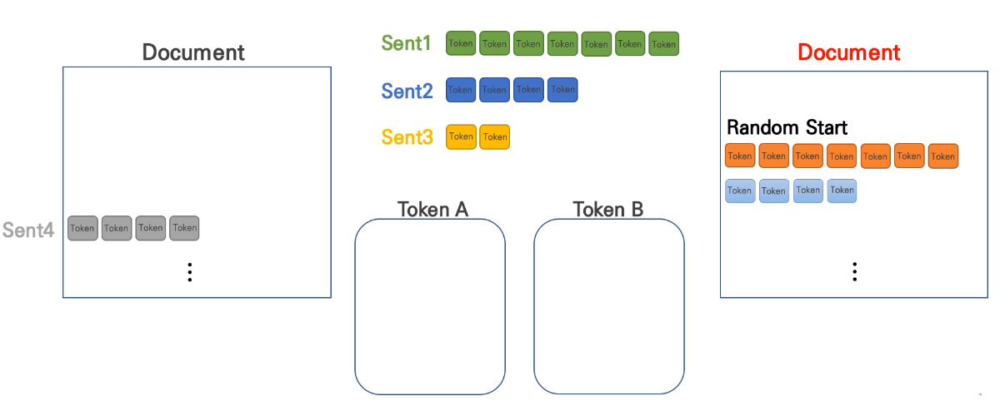

* 만약 random index가 2라면 Sent2까지 Token A이고 Sent3은 Token B로

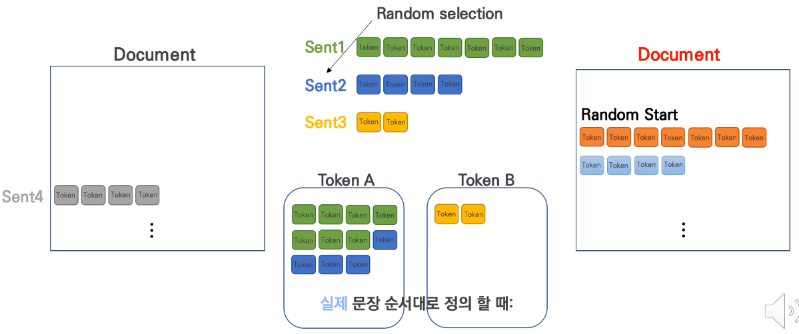

* 틀린 문장 순서대로 정의 시에는 다른 랜덤한 문서에서 랜덤한 문장의 시작점에서 문장을 가져옴


* 문서 내에 문장이 하나만 있을 경우는 Token A에 문장을 넣고 틀린 문장을 랜덤한 문서에서 가져옴
* Randomness를 주고 bias를 피하기 위한 trick으로 문장 두 개의 단어 총 수가 최대 토큰 개수를 넘지 못할때까지 Token A, Token B 중 더 긴 Token 리스트에 대해 50% 확률로 문장 맨 앞 또는 맨 뒤의 토큰을 제거

### Token Sequence

* Token A, Token B를 사용하여 Token Sequence 생성
* Segment 임베딩을 위해 Seg\_ID 부여
* 15% 확률로 \[MASK\] 토큰 추가
  * Mask 토큰에 해당하는 위치를 placeholder로 저장
  * 최대 mask length는 하이퍼파라메터로 지정

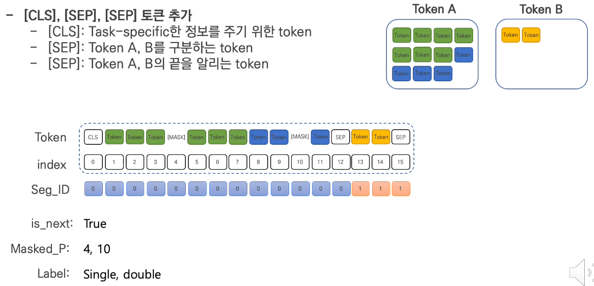


### Masking

Key masking만 사용 \(Transformer는 Query masking, Key masking 둘 다 사옹\)

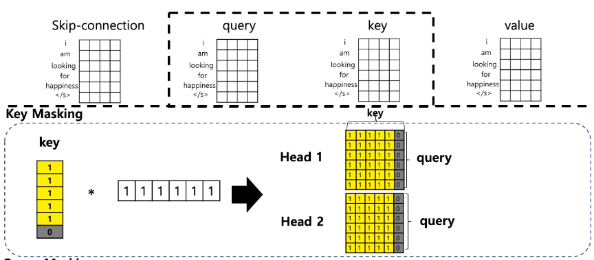

### **Mask Language Model** Loss 계산


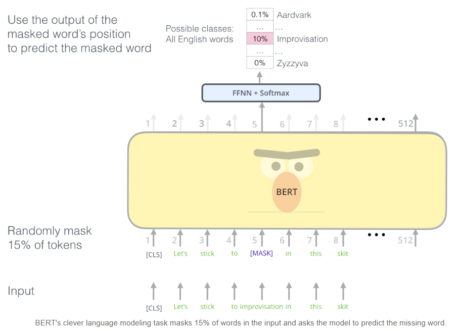

### Next Sentence Prediction\(NSP\) Loss 계산

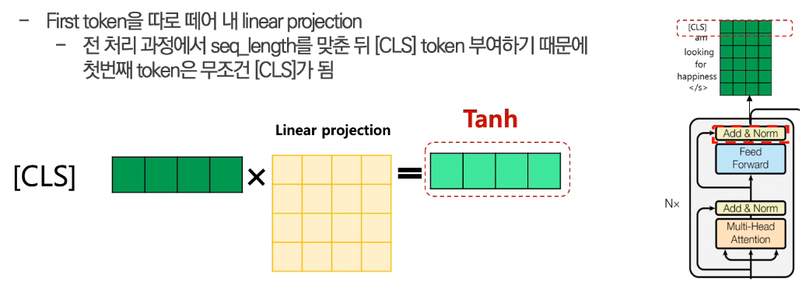

## 6. Word Embedding PyTorch Example

* Objective: 사전 학습된 BERT 모델을 로딩 후 "After stealing money from the bank vault, the bank robber was seen fishing on the Mississippi river bank." 문장이 주어졌을 때, bank의 의미를 서로 다르게 임베딩하는지 확인

```python
!pip install pytorch-pretrained-bert

import torch
from pytorch_pretrained_bert import BertTokenizer, BertModel, BertForMaskedLM

# OPTIONAL: if you want to have more information on what's happening, activate the logger as follows
import logging
#logging.basicConfig(level=logging.INFO)

import matplotlib.pyplot as plt
% matplotlib inline

# Load pre-trained model tokenizer (vocabulary)
tokenizer = BertTokenizer.from_pretrained('bert-base-uncased')
```

* 토크나이저로 입력 문장을 22개 토큰으로 분리

```python
# Define a new example sentence with multiple meanings of the word "bank"
text = "After stealing money from the bank vault, the bank robber was seen " \
       "fishing on the Mississippi river bank."

# Add the special tokens.
marked_text = "[CLS] " + text + " [SEP]"

# Split the sentence into tokens.
tokenized_text = tokenizer.tokenize(marked_text)

# Map the token strings to their vocabulary indeces.
indexed_tokens = tokenizer.convert_tokens_to_ids(tokenized_text)

# Mark each of the 22 tokens as belonging to sentence "1".
segments_ids = [1] * len(tokenized_text)

# Display the words with their indeces.
for tup in zip(tokenized_text, indexed_tokens):
    print('{:<12} {:>6,}'.format(tup[0], tup[1]))
```

```python
[CLS]           101
after         2,044
stealing     11,065
money         2,769
from          2,013
the           1,996
bank          2,924
vault        11,632
,             1,010
the           1,996
bank          2,924
robber       27,307
was           2,001
seen          2,464
fishing       5,645
on            2,006
the           1,996
mississippi   5,900
river         2,314
bank          2,924
.             1,012
[SEP]           102
```

* 사전 학습된 모델을 로드하여 입력 데이터에 대한 hidden states 계산

```python
# Convert inputs to PyTorch tensors
tokens_tensor = torch.tensor([indexed_tokens])
segments_tensors = torch.tensor([segments_ids])

# Load pre-trained model (weights)
model = BertModel.from_pretrained('bert-base-uncased')

# Put the model in "evaluation" mode, meaning feed-forward operation.
model.eval()

# Predict hidden states features for each layer
with torch.no_grad():
    encoded_layers, _ = model(tokens_tensor, segments_tensors)

# Each layer in the list is a torch tensor.
print('Tensor shape for each layer: ', encoded_layers[0].size()) # [1, 22, 768]
```

* `encoded_layers`가 리스트 형식으로 되어 있기 때문에 `torch.stack`으로 \[12, 1, 22, 768\] 형태의 텐서로 재구성

```python
# Concatenate the tensors for all layers. We use `stack` here to
# create a new dimension in the tensor.
token_embeddings = torch.stack(encoded_layers, dim=0)

print(token_embeddings.size()) # [12, 1, 22, 768]

# Remove dimension 1, the "batches".
token_embeddings = torch.squeeze(token_embeddings, dim=1)

# Swap dimensions 0 and 1.
token_embeddings = token_embeddings.permute(1,0,2)

print(token_embeddings.size()) # [22, 12, 768]
```

* 워드 벡터 생성 예시: 12개 layer 중 마지막 4개의 layer를 concatenate하여 생성하거나\(본 예시의 경우 dim: \[22, 3072\]\), 마지막 4개의 layer feature들의 평균으로 생성 \(dim: \[22, 768\]\)
* 문장 벡터 생성 예시: 간단하게 평균으로 계산 가능 \(dim: 768\)

```python
# Stores the token vectors, with shape [22 x 768]
token_vecs_sum = []

# `token_embeddings` is a [22 x 12 x 768] tensor.

# For each token in the sentence...
for token in token_embeddings:

    # `token` is a [12 x 768] tensor

    # Sum the vectors from the last four layers.
    sum_vec = torch.sum(token[-4:], dim=0)

    # Use `sum_vec` to represent `token`.
    token_vecs_sum.append(sum_vec)

print('Shape is: %d x %d' % (len(token_vecs_sum), len(token_vecs_sum[0])))  
print('First 5 vector values for each instance of "bank".')
print('')
print("bank vault   ", str(token_vecs_sum[6][:5]))
print("bank robber  ", str(token_vecs_sum[10][:5]))
print("river bank   ", str(token_vecs_sum[19][:5]))
```

```python
Shape is: 22 x 768
First 5 vector values for each instance of "bank".

bank vault    tensor([ 2.1319, -2.1413, -1.6260,  0.8638,  3.3173])
bank robber   tensor([ 1.1868, -1.5298, -1.3770,  1.0648,  3.1446])
river bank    tensor([ 1.1295, -1.4725, -0.7296, -0.0901,  2.4970])
```

* Cosine 유사도 확인

```python
from scipy.spatial.distance import cosine

# Calculate the cosine similarity between the word bank 
# in "bank robber" vs "river bank" (different meanings).
diff_bank = 1 - cosine(token_vecs_sum[10], token_vecs_sum[19])

# Calculate the cosine similarity between the word bank
# in "bank robber" vs "bank vault" (same meaning).
same_bank = 1 - cosine(token_vecs_sum[10], token_vecs_sum[6])

print('Vector similarity for  *similar*  meanings:  %.2f' % same_bank)
print('Vector similarity for *different* meanings:  %.2f' % diff_bank)
```

```python
Vector similarity for  *similar*  meanings:  0.95
Vector similarity for *different* meanings:  0.68
```

## References

* Paper
  * [https://arxiv.org/abs/1810.04805](https://arxiv.org/abs/1810.04805)
* Blog
  * [http://jalammar.github.io/illustrated-bert/](http://jalammar.github.io/illustrated-bert/)
  * [http://www.programmersought.com/article/2641874742/](http://www.programmersought.com/article/2641874742/)
  * [http://docs.likejazz.com/bert/](http://docs.likejazz.com/bert/)
  * [https://mccormickml.com/2019/05/14/BERT-word-embeddings-tutorial/](https://mccormickml.com/2019/05/14/BERT-word-embeddings-tutorial/)
* Video Clip
  * [https://www.youtube.com/watch?v=riGc8z3YIgQ](https://www.youtube.com/watch?v=riGc8z3YIgQ)
  * [https://www.youtube.com/watch?v=PzvKDpQgNzc](https://www.youtube.com/watch?v=PzvKDpQgNzc)
  * [https://www.youtube.com/watch?v=xhY7m8QVKjo](https://www.youtube.com/watch?v=xhY7m8QVKjo)

