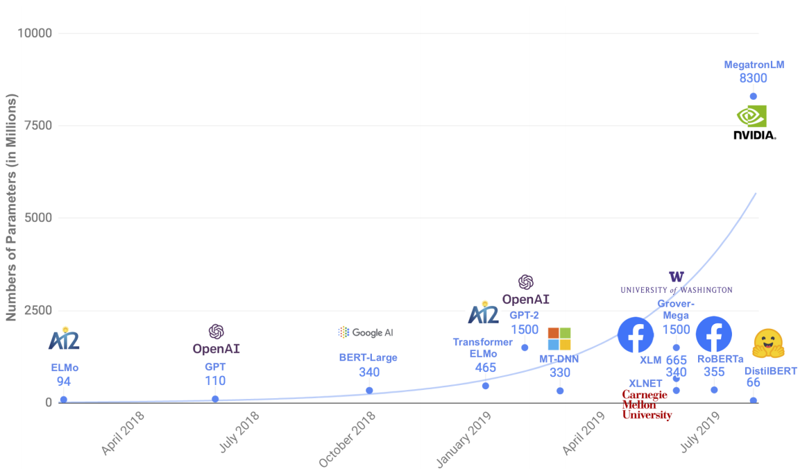
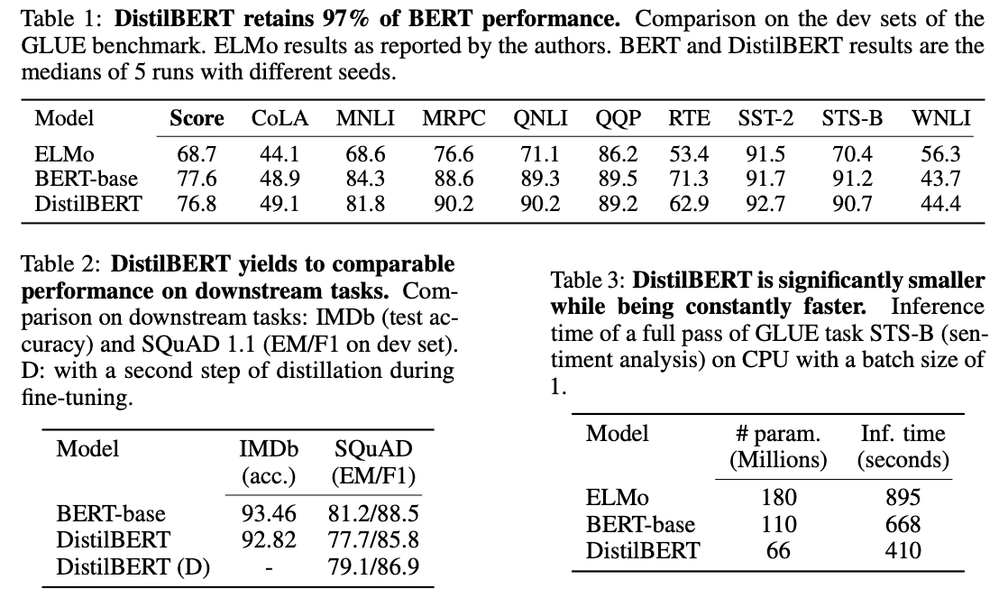

# DistilBERT, a distilled version of BERT

## 1. Background

* 계속 파라메터 개수가 증가; NVIDIA 최신 모델은 83억개의 파라메터
* Deployment시 모델 성능 vs. latency tradeoff
* Knowledge Distillation\(KD, 지식 증류\)로 BERT 모델을 다이어트해보는 것이 목적
  * KD는 Larger\(Teacher\) model로부터 Compact\(Student\) model를 생성하는 Hinton이 제안한 기법 

## 2. Experiment

* 95% 성능을 유지하면서 파라메터 개수를 40% 저감
* IMDB 리뷰 데이터셋에서 BERT는 93.46% 정확도, DistilBERT는 92.82% 정확도
* 추론 시에는 BERT 대비 60% 더 빠르고 ELMo+BiLSTM 대비 120% 더 빠름

## References

* Paper
  * [https://arxiv.org/pdf/1910.01108.pdf](https://arxiv.org/pdf/1910.01108.pdf)
* Blog
  * [https://medium.com/huggingface/distilbert-8cf3380435b5](https://medium.com/huggingface/distilbert-8cf3380435b5)
  * [http://jalammar.github.io/a-visual-guide-to-using-bert-for-the-first-time/](http://jalammar.github.io/a-visual-guide-to-using-bert-for-the-first-time/)
* Implementation
  * [https://github.com/huggingface/transformers](https://github.com/huggingface/transformers)

